# Historia de los Sistemas Operativos, Hardware y Software

## De computadoras que ocupaban habitaciones enteras al sistema operativo de tu celular


---

## Idea central

La historia de los sistemas operativos es la historia de **problemas que los ingenieros y computólogos tuvieron que resolver** en cada época:

> **¿Qué problema intentaban resolver  en cada época?**

### Evolución de los sistemas operativos

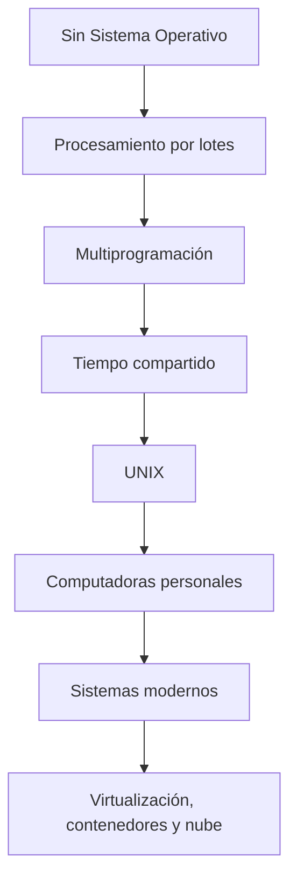

### Problemas que aparecen en cada etapa

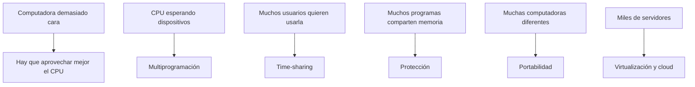

La historia de los sistemas operativos es, en buena medida, **la historia de cómo compartir recursos costosos de forma eficiente y segura**.

---

## Objetivos de aprendizaje

Al finalizar esta sesión, deberás ser capaz de:

1. Diferenciar **hardware, software y sistema operativo**.
2. Explicar por qué las primeras computadoras prácticamente no necesitaban sistema operativo.
3. Describir la evolución: procesamiento por lotes, multiprogramación, tiempo compartido, UNIX, computadoras personales y sistemas operativos modernos.
4. Explicar cómo el desarrollo del hardware permitió sistemas operativos cada vez más sofisticados.
5. Reconocer la influencia de factores económicos, militares y geopolíticos en la evolución de la computación.
6. Explicar las dos funciones fundamentales de un SO: administrar recursos y proporcionar abstracciones.
7. Relacionar problemas históricos con conceptos modernos como procesos, scheduling, memoria virtual, interrupciones, permisos, contenedores y máquinas virtuales.

---

## Introducción: una computadora sin sistema operativo

Imagina que la UNAM compra una computadora de varios millones de dólares, pero:

- No tiene Windows ni Linux.
- No tiene terminal ni archivos.
- No existe `printf()`.
- No existe el mouse.
- Ni siquiera existe el concepto moderno de **proceso**.

**¿Cómo ejecutarías un programa?**

En las primeras computadoras, los programadores interactuaban directamente con la máquina: conectaban cables, cargaban programas, introducían instrucciones con tarjetas perforadas o escribían directamente en memoria.

Ahora imagina que hay otras 20 personas esperando utilizar la misma computadora.

**¿Quién decide cuándo puede usarla cada una?**

En las primeras computadoras, **los humanos hacían muchas de las tareas que después realizaría el sistema operativo**.

---

## 1940–1950: antes del sistema operativo

Las primeras computadoras electrónicas eran radicalmente diferentes. Generalmente no existían:

- Sistemas operativos
- Terminales
- Interfaces gráficas
- Discos modernos
- Lenguajes de alto nivel como los actuales

```text
Programador
     │
     ▼
+------------+
| Hardware   |
| CPU        |
| Memoria    |
| I/O        |
+------------+
```

### Contexto histórico: Segunda Guerra Mundial

La Segunda Guerra Mundial aceleró enormemente el desarrollo de tecnología de cómputo. Había problemas de enorme interés militar:

- Criptografía
- Cálculos balísticos y tablas de tiro
- Navegación y simulaciones
- Procesamiento de grandes cantidades de información

Computadoras como **Colossus** (británicos, descifrado de comunicaciones alemanas) y **ENIAC** (Estados Unidos, cálculos de artillería) convirtieron la computación de un experimento académico en una tecnología estratégica.

> **Dato curioso:** ENIAC pesaba aproximadamente **30 toneladas** y utilizaba alrededor de **18,000 tubos de vacío**. Hoy, un teléfono tiene millones de veces más capacidad computacional.


>En 1936 **Alan Turing**  definió la **máquina de Turing**, modelo abstracto que formaliza qué significa *computar*. Una máquina de Turing **M = (Q, Σ, Γ, δ, q₀, F)** consta de:
>
>1. **Q** — conjunto finito de **estados** internos.
>2. **Σ** — **alfabeto de entrada** (símbolos que puede leer).
>3. **Γ** — **alfabeto de la cinta** (Σ ⊆ Γ), incluyendo un símbolo en blanco.
>4. **δ** — **función de transición** δ: Q × Γ → Q × Γ × {L, R} que, dado el estado actual y el símbolo bajo el cabezal, indica el nuevo estado, el símbolo a escribir y si el cabezal se mueve a la **izquierda (L)** o **derecha (R)**.
>5. **q₀** — **estado inicial**.
>6. **F** — conjunto de **estados finales** (aceptación).
>
>La máquina opera sobre una **cinta infinita** dividida en celdas, con un **cabezal de lectura/escritura** que ejecuta δ paso a paso. Este modelo demostró que existen problemas **indecidibles** y estableció que cualquier computadora digital es, en esencia, equivalente a una máquina de Turing — la base teórica de los sistemas operativos y de toda la informática.

### El problema económico

```text
COMPUTADORA = DINERO
```

Si una computadora cuesta una fortuna, no quieres verla esperando a que un humano cambie tarjetas o prepare el siguiente programa. Pero eso sucedía:

```text
CPU trabajando:        ████
CPU esperando humanos: ██████████████████████████████
```

Las personas  comenzaron a preguntarse: **¿Cómo podemos mantener ocupada la máquina?**

---

## Procesamiento por lotes (batch processing)

Una solución fue el **procesamiento por lotes**:

1. Los programadores entregan sus programas.
2. Un operador los reúne.
3. Se crea una cola de trabajos.
4. La computadora los ejecuta automáticamente.

```text
JOB A → JOB B → JOB C → JOB D
```

**Analogía:** en una lavandería no lavas una camiseta, esperas, lavas otra, esperas… Agrupas el trabajo. Eso es un **batch**.

### El monitor residente

El **monitor residente** (*resident monitor*) surgió a mediados de los **años 50** en los **centros de cómputo con mainframes** de Estados Unidos: laboratorios gubernamentales, universidades y empresas como **IBM** y **UNIVAC** que vendían máquinas enormes y carísimas durante la Guerra Fría.

En un principio, un **operador humano** cargaba cada programa, lo ejecutaba y preparaba el siguiente. Eso dejaba al CPU esperando. La solución fue un programa pequeño que **permanecía siempre en memoria** — de ahí *residente* — y automatizaba la secuencia de trabajos.

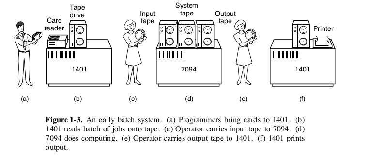

**¿Qué hacía?**

1. **Cargar** el siguiente trabajo desde tarjetas perforadas o cinta magnética.
2. **Transferir el control** al programa del usuario.
3. **Recuperar el control** cuando el trabajo terminaba (o fallaba).
4. **Gestionar la E/S** básica — lectura de entrada, impresión de salida — sin intervención humana entre trabajos.
5. **Pasar al siguiente** trabajo de la cola automáticamente.

```text
Antes (sin monitor)              Con monitor residente
───────────────────              ─────────────────────
humano carga programa            monitor carga programa
humano inicia ejecución          monitor inicia ejecución
humano prepara el siguiente      monitor pasa al siguiente solo
CPU espera al operador           CPU sigue trabajando
```

Por eso muchos historiadores lo consideran el **primer sistema operativo primitivo**: no era una aplicación que resolvía un cálculo, sino **software cuyo trabajo era administrar otros programas**.

Los trabajos se agrupaban en **lotes** sobre cinta magnética con una máquina auxiliar más barata; luego el mainframe los procesaba como un flujo continuo. El tiempo entre entregar un programa y recibir el resultado podía ser **horas o hasta un día entero**.

> **Dato curioso:** el monitor residente no tenía procesos, archivos ni usuarios interactivos como Linux hoy. Solo una cola de trabajos y reglas simples para pasar de uno al otro. Pero esa idea — *un programa permanente que coordina el resto* — es el germen de todo sistema operativo moderno.

### Programar era frustrante

Imagina escribir `printf("Hola mundo\n");`, entregar tu trabajo y, dos horas después, recibir:

```text
COMPILATION ERROR
```

Olvidaste un `;`. Corriges, vuelves a entregar y esperas otra vez.


---

## Multiprogramación

### El problema de I/O

Cuando un programa espera a un dispositivo lento (disco, teclado), la CPU queda inutilizada:

```text
CPU: ejecutando ██████████ | esperando I/O ............... | ejecutando ██████████
```

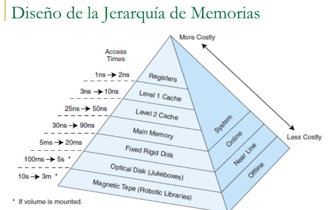

Descripción de registros x64: 

https://wiki.osdev.org/CPU_Registers_x86-64

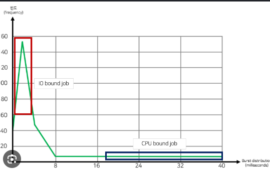
Pero hay otro programa esperando. Entonces surge la idea:

> **¿Por qué no ejecutar otro programa mientras el primero espera?**

Así nace la **multiprogramación**. En memoria pueden existir varios programas:


Ejemplo:

```text
Programa A → esperando disco
Programa B → listo
Programa C → esperando teclado

CPU → Programa B
```

### Nuevos problemas (y el temario del curso)

La multiprogramación crea preguntas fundamentales:

```text
¿Quién usa el CPU?          → Scheduling
¿Durante cuánto tiempo?     → Scheduling
¿Quién utiliza qué memoria? → Memory management
¿Puede A leer la memoria de B? → Protection
¿Qué pasa si A nunca termina?  → Processes
¿Dos programas escriben al disco? → I/O, Synchronization
```


### Hardware clave: interrupciones

Sin interrupciones, el CPU tendría que preguntar constantemente al dispositivo:

```text
¿Terminaste disco? ¿Ahora? ¿Ahora? ¿Ahora?
```

Esto se llama **polling** y es ineficiente.

Con una **interrupción**, el dispositivo avisa al CPU:

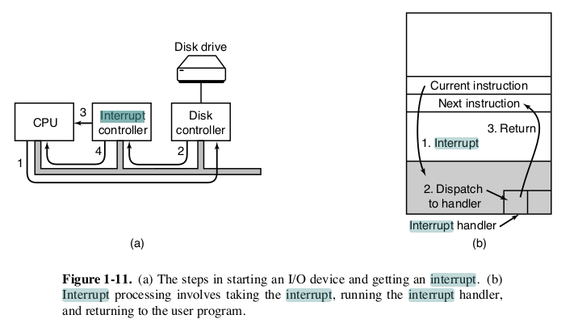

El CPU detiene temporalmente lo que hace y transfiere control al sistema operativo.

> **Importante:** muchas ideas de los SO dependen tanto del **hardware** como del software: interrupciones, timer, modos privilegiados, MMU y protección de memoria. Por eso Sistemas Operativos no es solamente una materia de software.

---

## Time-sharing (tiempo compartido)

La multiprogramación mejoró la utilización del CPU, pero los usuarios querían **interactividad**.

Imagina 20 terminales conectadas a una misma computadora. El sistema asigna pequeños intervalos de CPU a cada usuario:

```text
Tiempo →

A ███
B    ███
C       ███
A          ███
B             ███
```

Como el cambio ocurre rápidamente, cada usuario tiene la ilusión de utilizar la computadora sola. Eso es **time-sharing**.

**Idea clave:** un scheduler reparte el CPU en intervalos cortos, similar a turnarse con un recurso compartido muy rápido.

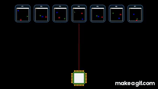

---


---

## 1969: un año importante

En 1969 ocurrieron tres acontecimientos distintos pero relacionados con una época de enorme inversión tecnológica:

```text
1969

Apollo 11 llega a la Luna
ARPANET comienza a operar
Comienza el desarrollo de UNIX
```

---

## UNIX

UNIX comenzó a desarrollarse en **Bell Labs**, con figuras fundamentales como **Ken Thompson** y **Dennis Ritchie**.

UNIX introdujo o popularizó ideas que siguen siendo centrales:

1. **Time-sharing interactivo** — varios usuarios pueden usar la máquina al mismo tiempo, escribir comandos y recibir respuestas al instante, en lugar de entregar trabajos y esperar horas.
2. **Todo es un archivo** — discos, teclados, pantallas y otros dispositivos se tratan de forma uniforme, como si fueran archivos. Eso simplifica cómo los programas acceden al hardware.
3. **Pipes y herramientas pequeñas** — en lugar de un solo programa enorme, Unix propuso muchos programas sencillos que hacen una cosa bien y se pueden encadenar.
4. **Portabilidad con C** — al reescribir Unix en el lenguaje C, el mismo sistema pudo correr en distintas computadoras.

```text
procesos · archivos · pipes · shell
jerarquía de directorios · permisos · herramientas pequeñas
```

https://www.tuhs.org/Archive/Distributions/Research/McIlroy_v0/UnixEditionZero-Threshold_OCR.pdf (1974)

### La filosofía Unix

> Haz programas pequeños que hagan una cosa bien y permite combinarlos.

```bash
ls | grep ".c" | wc -l
```

```text
ls → grep → wc
```

La salida de un programa se convierte en la entrada del siguiente. El símbolo `|` representa un **pipe**.

### C y UNIX crecieron juntos

UNIX inicialmente tenía partes escritas en ensamblador. Dennis Ritchie desarrolló **C** y una buena parte de UNIX fue reescrita en C.

Antes:

```text
Sistema Operativo → Hardware específico
```

Con C:

```text
               UNIX (escrito en C)
                 │
        ┌────────┴────────┐
        ▼                 ▼
   Hardware A         Hardware B
```

Esto permitió **portabilidad** entre arquitecturas. No es casualidad que en una clase moderna de Sistemas Operativos sigamos usando C.

> **Dato curioso:** antes de UNIX existía **MULTICS** (*Multiplexed Information and Computing Service*). UNIX surgió como un sistema mucho más pequeño; su nombre fue un juego de palabras relacionado con MULTICS.

---

## Computadoras personales (años 70–80)

Hasta aproximadamente los años 70:

```text
muchas personas → una computadora
```

Con la caída del precio del hardware y los microprocesadores:

```text
una persona → una computadora
```

Las prioridades cambiaron. Ya no se diseñaba todo para 100 usuarios compartiendo una máquina. Comenzaron a importar:

- Interfaces fáciles de usar
- Gráficos, teclado y mouse
- Aplicaciones personales


---

## 1980–1990: PC, interfaces gráficas y competencia comercial

Empresas como **Apple**, **Microsoft** e **IBM** transformaron el mercado. El sistema operativo pasó de usarse principalmente por científicos, ingenieros, universidades y gobierno, a usarse por prácticamente cualquier persona.

En esta misma época, el software empezó a dividirse en dos modelos:

```text
Software propietario          Software libre / open source
─────────────────────         ────────────────────────────
código cerrado                código visible y modificable
licencia restrictiva          licencia que permite copiar y mejorar
Windows, macOS clásico        GNU, Linux, BSD
```

---

## Open source y el software libre

Hasta los años 70, muchos investigadores **compartían código** como parte de la cultura académica. UNIX circulaba con su código fuente entre universidades. Pero cuando las computadoras personales y el mercado comercial crecieron, cada vez más empresas **cerraron el código** y vendieron el software como producto.

### El problema que intentaba resolver

Imagina que compras una computadora, pero:

- No puedes ver cómo funciona el sistema operativo por dentro.
- No puedes corregir un error aunque sepas programar.
- No puedes adaptarlo a tus necesidades.
- Depende de una sola empresa para que siga existiendo.

Para muchos programadores — especialmente en universidades — eso era inaceptable. Querían la misma libertad que habían tenido con UNIX en los laboratorios: **estudiar, modificar y compartir** el software.

### GNU y la idea del software libre

En **1983**, **Richard Stallman** inició el proyecto **GNU** (*GNU's Not Unix*) con una meta explícita: construir un sistema operativo completo, compatible con UNIX, pero **libre**.

> **Software libre** no significa “gratis”. Significa que el usuario tiene **cuatro libertades**: ejecutar, estudiar, modificar y redistribuir el programa.

GNU produjo herramientas fundamentales que hoy siguen en casi todo sistema Linux:

```text
GCC (compilador) · Bash (shell) · Emacs · utilidades del sistema
```

Para completar el sistema faltaba la pieza más crítica: el **kernel**.

### Open source: colaboración a escala planetaria

En los **90**, el término **open source** popularizó una idea parecida con énfasis práctico: publicar el código fuente permite que **miles de desarrolladores** encuentren errores, propongan mejoras y porten el software a hardware nuevo.

```text
Modelo propietario              Modelo open source
──────────────────              ──────────────────
pocos desarrolladores           comunidad global
bugs ocultos                    muchos ojos revisando
dependencia del vendor          cualquiera puede mantenerlo
innovación cerrada              mejoras compartidas
```

**¿Qué papel juega en la historia de los SO?** El open source no inventó procesos, archivos ni scheduling. Pero cambió **cómo se construyen y distribuyen** los sistemas operativos modernos:

1. **Democratizó el acceso** — cualquier universidad, empresa o persona puede estudiar un kernel real.
2. **Aceleró la innovación** — TCP/IP, el stack web, contenedores y la nube crecieron sobre herramientas abiertas.
3. **Definió la infraestructura global** — la mayoría de servidores, supercomputadoras y datacenters corren Linux.
4. **Permeó dispositivos cotidianos** — Android usa el kernel de Linux; routers, TVs y autos usan componentes open source.

> **Dato curioso:** cuando Linus Torvalds publicó Linux en 1991, lo hizo bajo la licencia **GPL** de GNU. Por eso a menudo se habla de **GNU/Linux**: kernel de Linus + herramientas del proyecto GNU.

---

## Linux y el mundo moderno

En **1991**, **Linus Torvalds**, estudiante en Helsinki, comenzó un kernel como proyecto personal. Estaba frustrado porque **MINIX** (un Unix educativo) era demasiado restrictivo para experimentar. Publicó el código en Internet y otros desarrolladores empezaron a contribuir.

Linux no nació en una empresa: nació como **proyecto open source** que creció gracias a la red y a las herramientas GNU ya existentes.

```text
Kernel Linux  +  GNU tools  +  contribuciones de la comunidad  =  GNU/Linux
```

Hoy Linux está presente en:

```text
servidores · cloud · supercomputadoras · routers
Android · IoT · embedded systems
```

> El **kernel de Linux** se utiliza en muchos sistemas, por ejemplo en **Android**. La mayor parte de Internet — desde Google hasta Netflix — corre sobre infraestructura Linux.

### ¿Por qué importa para Sistemas Operativos?

En este curso usarás Linux precisamente porque el open source te permite:

```bash
strace ./programa      # ver system calls
cat /proc/cpuinfo      # inspeccionar el kernel
gcc -Wall programa.c   # compilar con herramientas abiertas
```

No solo **usas** el sistema operativo: puedes **observarlo por dentro**. Eso era casi imposible con los SO propietarios de los años 80.

---

## Evolución completa

```text
1940   SIN SISTEMA OPERATIVO — Humanos controlan directamente la máquina
1950   BATCH PROCESSING — Monitor residente, tarjetas perforadas
1960   MULTIPROGRAMACIÓN — Mantener ocupado el CPU
1960–70 TIME-SHARING — Muchos usuarios interactivos
1970   UNIX — Procesos + archivos + pipes + portabilidad
1980   PERSONAL COMPUTERS — Una computadora por usuario
1990   OPEN SOURCE — GNU + Linux + Internet
2000   MÓVILES + VIRTUALIZACIÓN
2010+  CLOUD + CONTAINERS
HOY
```

Lo importante: las ideas anteriores **no desaparecieron**. Se **acumularon**.

---

## De los mainframes a la nube

En los años 60:

```text
COMPUTADORA CARÍSIMA → muchos usuarios → hay que compartirla eficientemente
```

Hoy:

```text
DATACENTER CARÍSIMO → miles de clientes → hay que compartirlo eficientemente
```

El problema fundamental reaparece. Ahora utilizamos:

```text
máquinas virtuales · contenedores · orquestadores · cloud computing
```

> AWS y Azure resuelven a escala planetaria algunos de los mismos problemas conceptuales que los mainframes intentaban resolver hace décadas.

### Virtualización moderna

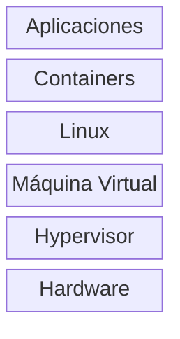

Seguimos preguntando: **¿Cómo compartir hardware sin que un usuario interfiera con otro?**

---

## Hardware, software y sistema operativo

### Hardware

Hardware son los componentes físicos:

```text
CPU
Memoria principal - RAM
SSD / HDD
GPU
teclado
monitor
tarjeta de red
USB
```

#### CPU

La CPU ejecuta instrucciones siguiendo un ciclo:

```text
Fetch → Decode → Execute → Fetch → ...
```

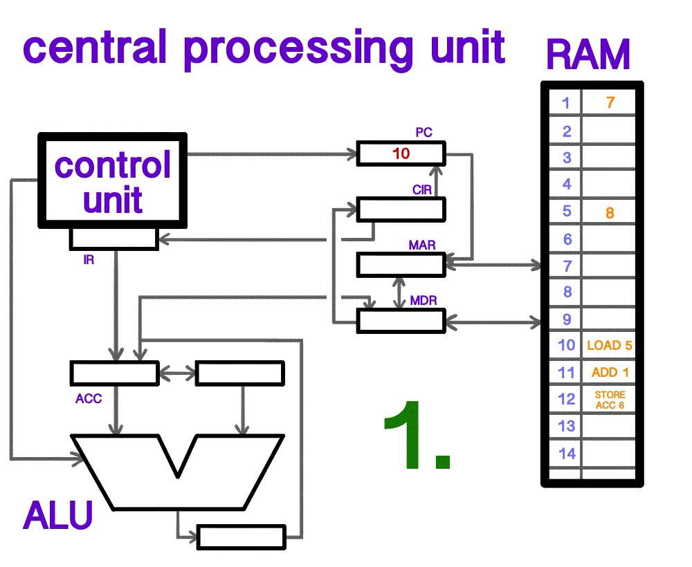

Una CPU entiende **instrucciones máquina**. No entiende directamente conceptos como Chrome, Spotify, Word, Docker, archivo, usuario, ventana o proceso. Estos son conceptos construidos mediante software.

Registros y cómo se utilizan en linux.
https://math.hws.edu/eck/cs220/f22/registers.html


`lscpu`

endianess
https://bytebytego.com/guides/big-endian-vs-little-endian/
#### Memria principal - RAM

La RAM almacena temporalmente instrucciones y datos que están siendo utilizados:

```text
SSD (programa almacenado)
  ↓ cargar
RAM (instrucciones en uso)
  ↓
CPU
```

Ejemplo:

```text
SSD                    RAM                      CPU
─────────────────      ─────────────────        ────
chrome                 Chrome ejecutándose
gcc                    GCC ejecutándose    →    ejecuta
programa.c             Sistema operativo
foto.jpg
```

RAM es normalmente **rápida**, **volátil** y **limitada**.

#### Almacenamiento

| RAM | SSD/HDD |
|-----|---------|
| Rápida | Más lento |
| Temporal | Persistente |
| Volátil | Mayor capacidad |

Esta diferencia será fundamental cuando estudies **memoria virtual**.

### Software

```text
SOFTWARE
│
├── Aplicaciones
│   ├── navegador
│   ├── videojuegos
│   ├── Spotify
│   └── VS Code
│
└── Software de sistema
    ├── sistema operativo
    ├── drivers
    ├── compiladores
    └── herramientas del sistema
```

El sistema operativo se encuentra **entre las aplicaciones y el hardware**.

### Diagrama: las capas de un sistema de cómputo


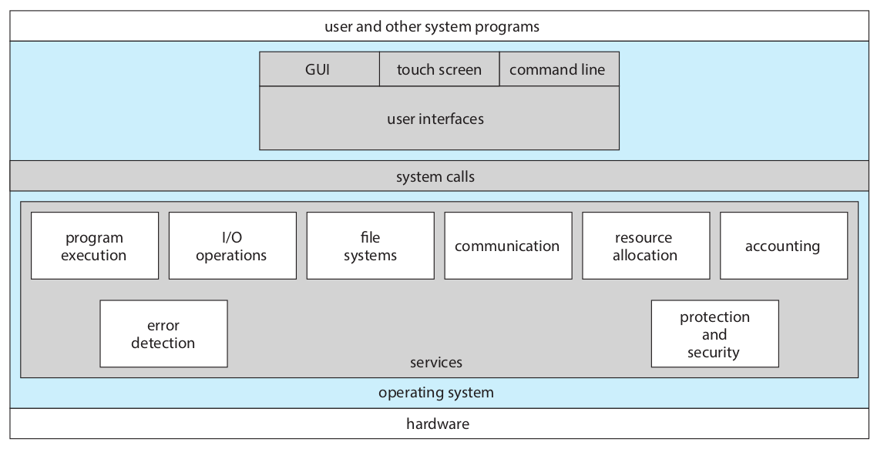


**Reflexiona:** ¿Por qué Chrome no debería poder controlar directamente el SSD?

Posibles razones:

- Podría borrar información de otros usuarios.
- Podría leer archivos ajenos.
- Dos programas podrían usarlo al mismo tiempo y corromper datos.
- Cada dispositivo de almacenamiento es diferente; programar directamente sería muy difícil.

El sistema operativo actúa como **intermediario**.

### Las tres grandes funciones del sistema operativo

> **Un sistema operativo es un administrador de recursos (réferi) , un proveedor de abstracciones (ilusionista), interfaz común entre programas (pegamento).**

#### Función 1: administrador de recursos (réferi)

```text
                   CPU
                    │
          ┌─────────┼─────────┐
          ▼         ▼         ▼
       Chrome     Spotify     GCC
```

Los tres quieren utilizar el CPU. ¿Quién corre primero? El sistema operativo decide. Lo mismo ocurre con RAM, SSD, red, GPU, impresora y USB.

#### Función 2: proveedor de abstracciones (ilusionista)

Un SSD físico trabaja con bloques, pero una aplicación no dice "lee el bloque físico 875923". Dice:

```c
open("calificaciones.txt", O_RDONLY);
```

El sistema operativo proporciona la abstracción llamada **archivo**:

```text
Abstracción        Realidad física

proceso         →  CPU
archivo         →  bloques de almacenamiento
memoria virtual →  RAM
socket          →  hardware de red
```

---

#### Función 3: proveedor de interfaces de interacción (pegamento)

El SO **une programas que no se conocen** mediante una interfaz común: **llamadas al sistema** y **APIs**. Cada aplicación habla con el SO, no directamente con las demás ni con el hardware.

Para comunicarse entre sí, el SO ofrece mecanismos como **pipes**, **sockets**, **archivos** y **señales**.

```bash
ls | grep ".c" | wc -l    # el SO conecta la salida de uno con la entrada del otro
```

Gracias a interfaces estándar (`open`, `read`, `write`, …), programas distintos pueden trabajar juntos sin reescribir código.

---

## Práctica en Linux

Las ideas históricas siguen vivas en tu sistema. Explora con estos comandos.

### Ver el CPU

```bash
lscpu
nproc
```

Observa: Architecture, CPU(s), Core(s), Thread(s), Virtualization.

**Pregunta:** ¿Cuántos CPUs lógicos tienes?

### Ver memoria

```bash
free -h
sudo dmidecode --type memory
```

Ejemplo de salida:

```text
              total       used       free
Mem:           16Gi        7Gi        3Gi
```

**Pregunta:** Si tienes cientos de procesos, ¿cómo comparten 16 GB? (Introducción a memoria virtual.)

### Ver procesos

```bash
ps -ef
# o
ps aux
```

Contar procesos:

```bash
ps -e --no-headers | wc -l
```

Comparar con CPUs lógicos:

```bash
nproc
```

**Pregunta:** Si tienes, por ejemplo, 327 procesos y solo 8 CPUs lógicos, ¿cómo es posible?

### Ver procesos

```bash
lsblk  (block devices)
lspci
lsmod
```


---

## Preguntas para reflexionar

1. Una computadora ejecuta un programa que solicita información al disco y debe esperar. Hay otro programa listo. **¿Qué debería hacer el sistema operativo?**

2. **¿Por qué Chrome no debería poder leer directamente cualquier posición física de RAM?**

3. Tu laptop tiene 8 CPUs lógicos pero 350 procesos. **¿Cómo puede ocurrir?**

*(Las respuestas están en la sección de repaso al final.)*

---


###  Hardware vs. abstracciones

Ejecuta:

```bash
lscpu
free -h
lsblk
ps -e
```

Responde:

1. ¿Cuántos CPUs lógicos existen?
2. ¿Cuánta RAM física existe?
3. ¿Cuántos procesos existen?
4. ¿Hay más procesos que CPUs?
5. ¿Qué dispositivos de almacenamiento aparecen?
6. ¿Qué elementos corresponden a hardware?
7. ¿Qué elementos corresponden a abstracciones creadas por el SO?

### Reinventemos el sistema operativo

**Escenario (año 1965):**

- Tu computadora cuesta millones de dólares.
- Tiene un CPU.
- Diez científicos quieren utilizarla.
- El disco es lento.
- Algunos programas entran en loops infinitos.
- Algunos usuarios no deben poder leer la información de otros.

**Diseña el sistema.** En grupo, propón soluciones. Probablemente llegarán a ideas como:

```text
cola de trabajos              → Batch processing
ejecutar otro programa en I/O → Multiprogramación
intervalos cortos de CPU      → Scheduling / time-sharing
detener programas tras un tiempo → Timer interrupt
separar la memoria            → Memory protection
identificar usuarios          → Permissions
```

Has redescubierto aproximadamente 20 años de investigación en sistemas operativos.


---

## Terminología

| Término | Definición |
|---------|------------|
| **Hardware** | Componentes físicos del sistema |
| **Software** | Instrucciones y programas ejecutados por el hardware |
| **Operating System** | Software que administra recursos y proporciona abstracciones |
| **Kernel** | Parte privilegiada y central del sistema operativo |
| **Process** | Programa en ejecución junto con su contexto de ejecución|
| **Program** | Código ejecutable almacenado |
| **Batch Processing** | Procesamiento automático de grupos de trabajos |
| **Monitor residente** | Programa permanente en memoria que carga y ejecuta trabajos en secuencia; precursor del SO |
| **Multiprogramming** | Mantener múltiples programas disponibles para utilizar mejor el CPU |
| **Time-sharing** | Compartir rápidamente CPU entre múltiples procesos o usuarios |
| **Interrupt** | Evento que provoca que la CPU atienda al SO o a un dispositivo |
| **System Call** | Mecanismo controlado para solicitar servicios al kernel |
| **Device Driver** | Software que permite al SO controlar determinado hardware |
| **Virtualization** | Creación de representaciones virtuales de recursos físicos |
| **Scheduler** | Componente que decide qué proceso o thread obtiene CPU |
| **Open Source** | Software cuyo código fuente es público y puede modificarse y redistribuirse |
| **Software libre** | Software que respeta las cuatro libertades del usuario (ejecutar, estudiar, modificar, compartir) |
| **GPL** | Licencia copyleft de GNU; exige que derivados también se distribuyan con el mismo tipo de libertad |

---

## Tarea

### ¿Por qué existe esta característica?

Elige **una** característica moderna:

```text
procesos · memoria virtual · filesystem · permisos
multitasking · device drivers · containers
virtual machines · system calls
```

Responde en aproximadamente 1–2 páginas:

1. ¿Qué problema resuelve?
2. ¿Qué ocurriría si no existiera?
3. ¿Qué necesidad histórica ayudó a que apareciera?
4. ¿De qué soporte de hardware depende?
5. ¿Dónde puedo observarla actualmente en Linux?

Incluye al menos un comando como `ps`, `free`, `ls -l`, `lsblk`, `lscpu` o `uname`.

---


### Línea de tiempo

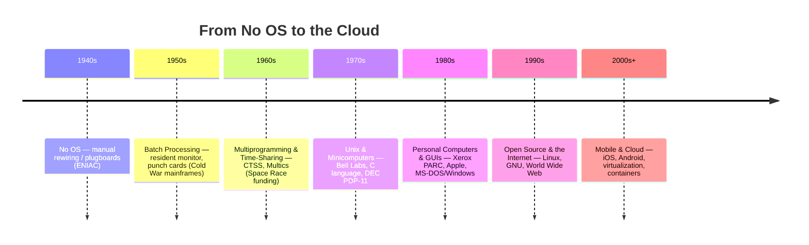


### Mensaje final

> Un sistema operativo apareció porque las computadoras eran caras, lentas, compartidas y cada vez más complejas.

Cada generación solucionó un problema y creó otros nuevos:

```text
Compartir CPU        → Scheduling
Compartir RAM        → Memory management
Compartir disco      → Filesystems
Compartir datos      → Synchronization
Compartir hardware   → Drivers
Compartir sistemas   → Virtualization
Compartir datacenter → Cloud
```

> **Sistemas Operativos es la historia de cómo convertir hardware limitado y complejo en abstracciones que muchos programas puedan utilizar de manera eficiente, segura y aparentemente simultánea.**

---


## Datos curiosos adicionales

- Las computadoras alguna vez fueron operadas físicamente por humanos como recurso central de una organización. Hoy desperdiciamos más capacidad computacional cargando anuncios en una página web que la que tuvieron muchas computadoras históricas completas.

- El término **bug** existía antes de las computadoras. En 1947, el equipo de Grace Hopper encontró una polilla atrapada en un relay de la Harvard Mark II y la pegó en su bitácora.

- UNIX comenzó en 1969; Linux en 1991. Más de medio siglo después, seguimos usando comandos e ideas enormemente influenciadas por UNIX.

- Linux empezó como un mensaje en un foro de Usenet pidiendo comentarios sobre un proyecto “pequeño” de hobby. Hoy impulsa la mayor parte de Internet.

- Tu teléfono probablemente ejecuta más procesos simultáneamente que un mainframe antiguo hubiera podido imaginar.

- Un automóvil moderno puede contener decenas de unidades de control electrónicas, cada una ejecutando software especializado. La computación dejó de estar solo en "las computadoras".
