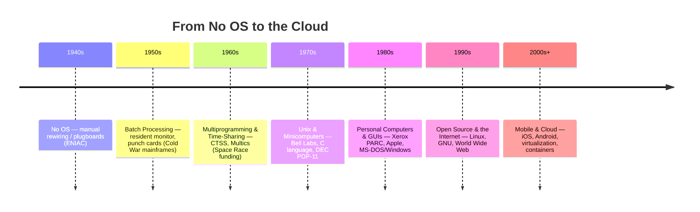
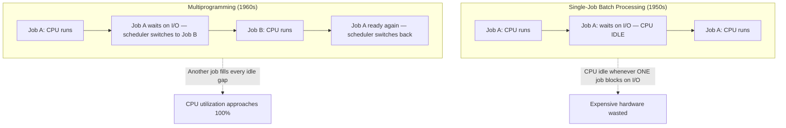

# The History of Operating Systems, Hardware, and Software

**Course:** Introduction to Operating Systems
**Session length:** 90 minutes
**Level:** University (undergraduate, first OS course)

---

## Cold Open (read this before class)

In 1945, "computer" was a job title, not a machine — it meant a person, usually a woman, doing arithmetic by hand. Twenty-five years later, a single machine at Bell Labs was running dozens of programs at once, for dozens of users, none of whom could see each other's work. Today, the phone in your pocket runs an operating system managing more processes, more security boundaries, and more concurrent hardware than the entire Apollo program's ground infrastructure.

Nobody designed the operating system in one sitting. It was **forced into existence** — by wasted time, by the Cold War, by lawsuits, by one very stubborn Finnish student who didn't like his university's Unix license. This class is that story.

---

## Learning Objectives

By the end of this session, students will be able to:

1. **Explain** why operating systems exist at all — what problem they solve that raw hardware cannot.
2. **Trace** the major eras of OS evolution (no-OS → batch → multiprogramming → time-sharing → personal computing → networked/open-source → mobile/cloud) and the hardware constraint that defined each one.
3. **Distinguish** between core concepts introduced at each stage: batch processing, multiprogramming, time-sharing, multitasking, virtual memory, and virtualization.
4. **Connect** historical/geopolitical events (WWII, the Cold War, the Space Race, antitrust law, the PC wars) to specific technical design decisions still visible in modern OS design.
5. **Identify** common misconceptions about "who invented the OS" and what an operating system actually does.

---

## Why This Matters (Motivation)

Every OS course eventually asks students to reason about schedulers, memory managers, and system calls as abstract mechanisms. But none of these mechanisms were inevitable — each was a *response* to a specific bottleneck, usually an expensive one:

- **Batch processing** existed because a $1M mainframe sitting idle while an operator loaded punch cards was an unacceptable waste of money.
- **Time-sharing** existed because researchers were tired of submitting a job and waiting *hours* for a printout only to discover a missing semicolon.
- **Virtual memory** existed because programs were starting to outgrow physical RAM, and programmers were wasting weeks manually overlaying code segments.
- **Protected memory and user/kernel mode** existed because time-sharing meant strangers were now running code on the same machine — and one bad (or malicious) program could crash it for everyone.
- **Portable OSes (Unix) and open source (Linux)** existed partly because of a 1956 antitrust consent decree and a graduate student's licensing frustration in 1991.

Every constraint your students will study this semester — scheduling, memory protection, file systems, concurrency — is the *fossil record* of a real economic or political pressure. Understanding the history makes the mechanisms feel inevitable instead of arbitrary, and it's a far better way to remember *why* `fork()` looks the way it does than memorizing a man page.

---

## 90-Minute Lesson Plan

| Time | Duration | Segment |
|---|---|---|
| 0:00–0:05 | 5 min | Cold open + framing question: "What does an OS actually *do* that hardware can't?" |
| 0:05–0:10 | 5 min | Learning objectives & roadmap |
| 0:10–0:25 | 15 min | Era 1: No OS → Batch Processing (1940s–1950s) |
| 0:25–0:40 | 15 min | Era 2: Multiprogramming & Time-Sharing (1960s) |
| 0:40–0:55 | 15 min | Era 3: Unix & the Minicomputer Revolution (1970s) |
| 0:55–1:10 | 15 min | Era 4: Personal Computers & GUIs (1980s) |
| 1:10–1:20 | 10 min | Era 5–6: Open Source, Networking, Mobile & Cloud (1990s–today) |
| 1:20–1:30 | 10 min | Misconceptions, summary, and Q&A |

---

## Theoretical Explanation: The Six Eras

### Era 0 — No Operating System (1940s)

The first electronic computers (ENIAC, 1945) had no OS because they had no concept of a "program" separate from wiring. Programming ENIAC meant physically re-plugging cables and setting switches — it took a team of women (Kay McNulty, Jean Bartik, and colleagues, among the first programmers in history) days to "reprogram" a calculation.

**The bottleneck:** the machine and the programmer could never work at the same time. Every second of setup was a second of a room-sized, power-hungry machine sitting idle.

### Era 1 — Batch Processing (mid-1950s)

**Geopolitical context:** This is Cold War computing. IBM, Sperry Rand (UNIVAC), and others were racing to sell mainframes to a U.S. government obsessed with codebreaking, nuclear weapons calculations, and Census-scale data processing. Computing power was treated as a strategic asset, not a hobby.

The fix for wasted machine time was the **resident monitor** — a small permanent program that automatically loaded jobs from a stack of punch cards, ran them one after another, and handled printing results — no human operator intervention required between jobs. This is arguably the first "operating system": software whose entire job was to manage *other* software.

Jobs were literally batched onto **magnetic tape** by a smaller, cheaper machine, then fed to the expensive mainframe as a continuous stream — hence *batch processing*. Turnaround time (submit job → get printout) was often **hours to a full day**.

**Fun fact:** Programmers would sometimes wait so long for a batch run that they'd find out about a *missing semicolon* the next morning — a single typo could cost a full day of turnaround.

### Era 2 — Multiprogramming & Time-Sharing (1960s)

**Geopolitical context:** Sputnik (1957) triggered the creation of ARPA (1958), the Apollo Program pushed real-time computing forward, and MIT, with heavy Department of Defense funding, became a hotbed of experimental time-sharing research. The Cold War's "space race" anxiety translated directly into research funding for interactive computing.

Two big ideas emerged together:

- **Multiprogramming**: keep *several* jobs in memory at once. While Job A waits on slow I/O (like reading a tape), the CPU switches to Job B instead of sitting idle. This is the first real *scheduler*.
- **Time-sharing**: extend that idea to *humans*. By switching between users' programs many times per second, a single mainframe could give dozens of people the illusion of having the machine to themselves, interacting live via a terminal instead of punch cards.

MIT's **CTSS** (Compatible Time-Sharing System, 1961) was the proof of concept. Its far more ambitious successor, **Multics** (1965, a joint MIT/Bell Labs/GE project), aimed to build a computing utility — like electricity — for an entire city. Multics was hugely influential but famously over-engineered and commercially disappointing.

**Fun fact:** Bell Labs pulled out of the Multics project in 1969, frustrated with its complexity. Two of their researchers, **Ken Thompson and Dennis Ritchie**, kept experimenting on a spare PDP-7 minicomputer — and, almost as a joke, named their small, stripped-down alternative **Unics**, later respelled **Unix**. Simplicity, as a reaction to Multics' complexity, became Unix's entire design philosophy.

### Era 3 — Unix & the Minicomputer Revolution (1970s)

**Geopolitical/legal context:** In 1956, AT&T (Bell Labs' parent company) signed an antitrust consent decree barring it from selling software commercially — it was a regulated telephone monopoly and had to stay in its lane. As a result, AT&T gave **Unix source code away to universities almost for free** through the 1970s. This single legal detail is arguably why Unix — and not a proprietary IBM or DEC system — became the shared academic foundation for modern OS design.

Unix introduced ideas still core to every OS today:

- Everything is either a **process** or a **file** — a radically simple, uniform model.
- Written largely in **C** (created by Ritchie specifically for this purpose), making Unix one of the first *portable* OSes — it could be recompiled for new hardware instead of rewritten from scratch.
- Small, composable tools connected with **pipes**, rather than one giant monolithic program.

Meanwhile, **DEC's minicomputers** (like the PDP-11) were shrinking computing from room-sized mainframes to something that fit in an office — cheap enough for a university department, not just a government or bank.

### Era 4 — Personal Computers & Graphical UIs (1980s)

**Geopolitical/business context:** This is also the era of the **U.S.–Japan tech rivalry** — Japan's MITI-backed "Fifth Generation Computer" project alarmed U.S. policymakers and spurred American investment, though it ultimately underdelivered. Meanwhile, IBM's 1981 decision to build the IBM PC from off-the-shelf parts — and license its OS from a small company called Microsoft rather than own it outright — is one of the most consequential business decisions in computing history. It created the "IBM-compatible" clone market and made Microsoft, not IBM, the long-term winner of the PC era.

Key threads:

- **Xerox PARC** (early-mid 1970s) invented the mouse-driven graphical user interface, overlapping windows, and Ethernet — but Xerox, a copier company, didn't know what to do with it commercially.
- **Apple**, after a famous 1979 visit to PARC, shipped the GUI to consumers with the Lisa (1983) and Macintosh (1984).
- **Microsoft** shipped Windows (1985) as a graphical layer on top of MS-DOS, riding the wave of IBM-compatible clone hardware to eventual dominance.
- The **operating system, not the CPU, became the platform.** Software vendors now wrote for "DOS/Windows" or "Mac OS," and this lock-in shaped the entire software industry's economics for decades.

**Fun fact:** Apple later sued Microsoft over Windows' look-and-feel, arguing it copied the Mac GUI — while Apple itself had licensed ideas seen at Xerox PARC. Steve Jobs is often quoted (paraphrasing a real 1996 interview) comparing the situation to "we both had this rich neighbor named Xerox... and I found out later that [Microsoft] had been stealing from us." The irony was not lost on anyone.

### Era 5 & 6 — Open Source, Networking, Mobile, and Cloud (1990s–today)

**Geopolitical/cultural context:** The early 1990s saw the fall of the Berlin Wall (1989) and the USSR (1991) — coincidentally the same moment the **World Wide Web** (1991, CERN, a European particle physics lab) and **Linux** (1991) were born. A more interconnected, post-Cold-War world matched a more interconnected, collaboratively-built software world.

- **Linus Torvalds**, a student in Helsinki, Finland, started Linux in 1991 as a hobby project because he was frustrated that MINIX (a teaching Unix clone) was too restricted for tinkering. Combined with Richard Stallman's GNU project and tools (started 1983), Linux became a free, open, Unix-like OS that now powers most of the world's servers, all Android phones, and most cloud infrastructure.
- **The internet** turned the OS's job from managing one machine to managing a machine that is constantly talking to millions of others — networking stacks became core OS responsibilities, not add-ons.
- **Virtualization and containers** (2000s–2010s) let one physical machine pretend to be many independent ones — the direct descendant of 1960s time-sharing, just one abstraction layer higher (a "guest OS" instead of a "user process").
- **Mobile OSes** (iOS 2007, Android 2008) re-fought many 1960s battles — power management, tightly constrained memory, and *permissions* — because a phone, like a 1960s mainframe, has to safely run code from parties who don't trust each other.

---

## Diagram 1 — Timeline of OS Eras

## Diagram 2 — Why Multiprogramming Beat Batch Processing

*The core insight: I/O (disks, tape, printers) is thousands of times slower than the CPU. A scheduler that can hold multiple jobs in memory and switch between them the instant one blocks on I/O turns wasted waiting time into useful work for someone else. This single idea — keep the CPU busy by juggling multiple things — is the ancestor of every scheduler, every "multitasking" feature, and every thread scheduler running today.*

---

## Key Terminology

| Term | Definition |
|---|---|
| **Operating System (OS)** | Software that manages hardware resources (CPU, memory, I/O, storage) and provides a controlled way for programs to use them. |
| **Resident Monitor** | The earliest primitive OS: a small program that automatically sequenced batch jobs without human intervention. |
| **Batch Processing** | Running a queue of jobs one after another with no interactive input, to maximize machine utilization. |
| **Multiprogramming** | Keeping multiple programs in memory simultaneously so the CPU can switch to another job when one blocks on I/O. |
| **Time-Sharing** | Rapidly switching the CPU between multiple *interactive users*, giving each the illusion of exclusive access. |
| **Process** | A running instance of a program, with its own memory, state, and execution context. |
| **Scheduler** | The OS component that decides which process/job runs on the CPU next. |
| **Kernel** | The core of the OS that runs with full hardware privileges and manages processes, memory, and devices. |
| **System Call** | A controlled, defined way for a user program to request a service (like reading a file) from the kernel. |
| **User Mode / Kernel Mode** | Hardware-enforced privilege levels; user programs run restricted, the kernel runs unrestricted, preventing one program from corrupting another or the system. |
| **Virtual Memory** | An abstraction that gives each process the illusion of its own large, private memory space, backed by physical RAM and disk. |
| **GUI (Graphical User Interface)** | A visual, mouse/touch-driven way of interacting with a computer, as opposed to typing text commands. |
| **Open Source** | Software whose source code is publicly available to view, modify, and redistribute (e.g., Linux, GNU tools). |
| **Virtualization** | Software (a hypervisor) that lets one physical machine run multiple independent "guest" operating systems. |
| **POSIX** | A standard defining a common API across Unix-like systems, so software could be portable between them. |

---

## Common Mistakes & Misconceptions

- **"One person invented the operating system."** False — it emerged gradually from real institutional pain points (wasted mainframe time, frustrated researchers), built by teams over decades, not a single inventor in a single year.
- **"Unix and Linux are the same thing."** Unix is the 1970s original (and its many commercial descendants); Linux is a *Unix-like* kernel written from scratch in 1991, inspired by Unix's design but sharing no original code with it.
- **"Batch processing is obsolete/irrelevant today."** The *concept* is alive and well — nightly data pipelines, CI/CD build queues, and cloud batch-compute services (e.g., large-scale data processing jobs) are direct descendants of 1950s batch processing.
- **"Time-sharing and multitasking are the same thing."** Time-sharing specifically refers to sharing a system among multiple *simultaneous human users*; multitasking more generally refers to a system (even single-user) running multiple *programs* concurrently. Related, but not identical.
- **"GUIs were invented by Apple or Microsoft."** Both largely commercialized and popularized ideas pioneered earlier at Xerox PARC (and, further back, by Douglas Engelbart's 1968 "Mother of All Demos").
- **"Cloud computing is a brand-new idea."** Conceptually, renting time on a shared, remote, powerful computer is *exactly* what 1960s time-sharing bureaus did — the cloud is time-sharing with better networking and a credit card attached.
- **"Older systems were primitive and had nothing to teach us."** Many core ideas — protection rings, virtual memory, scheduling fairness — were solved (sometimes elegantly) decades ago and are simply being re-applied at new scales (mobile, cloud, containers).

---

## More Fun Facts for Lecture Color

- The word **"bug"** predates computing, but the most famous early computing instance is a real moth found stuck in a relay of the Harvard Mark II in 1947 — the team taped it into the logbook, and it's preserved at the Smithsonian.
- **Grace Hopper**, a U.S. Navy rear admiral and computer scientist, developed one of the first compilers and popularized the idea that programmers shouldn't have to write in raw machine code — a philosophical ancestor of the OS's job of abstracting hardware away from applications.
- **MS-DOS**, the OS that launched Microsoft into the stratosphere, wasn't originally written by Microsoft — Microsoft bought rights to an existing product (QDOS, "Quick and Dirty Operating System") from Seattle Computer Products and adapted it for IBM.
- The **Multics** project's ambition — hundreds of simultaneous users on one computing utility — sounds unremarkable today because we now casually run *thousands* of simultaneous "users" (containers, VMs, tenants) on a single physical cloud server.
- **Linus Torvalds** initially considered naming his OS "Freax" (free + freak + Unix); "Linux" was the name of the FTP directory a friend uploaded it to, and it stuck.
- The **Apollo Guidance Computer** (1960s) that helped land astronauts on the Moon had roughly 64 KB of memory and ran at ~0.043 MHz — a modern smartwatch is millions of times more powerful, running an OS that manages far more complexity.

---

## Summary — The Big Picture

- Operating systems were not planned in advance; they were **built to solve a specific bottleneck at each stage**: wasted machine time (batch), wasted human time (time-sharing), wasted portability (Unix), inaccessible computing (PCs/GUIs), and wasted isolation and trust boundaries (mobile/cloud security).
- Nearly every core OS concept students will study this semester — **scheduling, memory management, protection, system calls, file systems** — is a direct, traceable response to one of these historical pressures.
- **Geopolitics and law shaped technology as much as engineering did**: Cold War funding created time-sharing research; a 1956 antitrust decree gave away Unix; a 1981 licensing deal made Microsoft, not IBM, the platform owner of the PC era.
- The pattern **repeats at new scales**: batch processing → cloud batch jobs; time-sharing → cloud computing; multiprogramming → today's process/thread schedulers; Multics' "computing utility" dream → the literal cloud we use today.
- Understanding *why* each concept was invented makes it far easier to understand *how* it works — and to predict what the *next* bottleneck (and the next OS innovation) might be.

