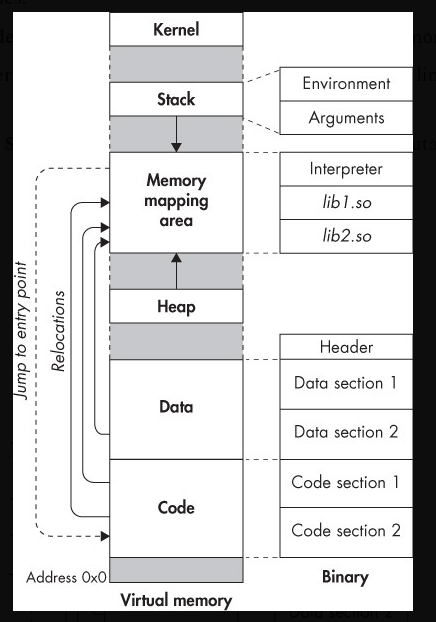
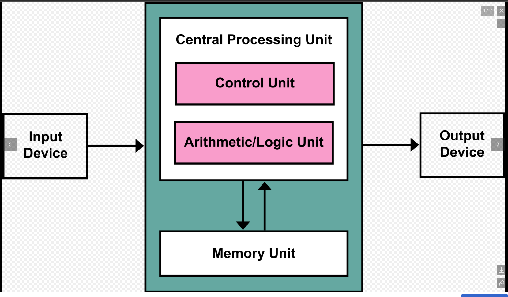

# Semana 1 — ¿Qué hace realmente un Sistema Operativo?

**Curso:** Sistemas Operativos (16 semanas)
**Proyecto:** MiniServ — servidor TCP/HTTP multiproceso en C sobre Linux
**Duración:** 2 sesiones × 90 minutos

**Pregunta central de la semana:**

> Cuando nuestro programa en C ejecuta `write(fd, buffer, size);`, ¿quién escribe realmente los datos?

---

## Visión general

Esta semana establece el modelo mental que usaremos las 15 semanas restantes. MiniServ aún no es un servidor de red: es un proceso que imprime `MiniServ iniciado`. Pero ese mensaje trivial ya nos obliga a preguntar qué proceso lo imprime, qué syscall ejecutó y qué recurso del kernel utilizó.

Al terminar la semana, el estudiante podrá:

1. Explicar por qué existe un SO como intermediario entre programas y hardware.
2. Identificar la frontera usuario/kernel y qué implica cruzarla.
3. Describir qué es un proceso (programa en ejecución con identidad y recursos).
4. Diferenciar `printf`, API POSIX (`write`) y system call real.
5. Analizar con `strace` las llamadas al sistema de programas simples.
6. Crear la estructura inicial de MiniServ y compilarla con `gcc -Wall -Wextra`.

**Continuidad hacia adelante:** la Semana 2 introduce file descriptors, `read`/`write` en detalle y sockets para convertir MiniServ en un servidor TCP secuencial.

---

# Clase 1 — 90 minutos

**Planeación temporal (referencia para el profesor):**


| Tiempo     | Hilo narrativo                                      |
| ---------- | --------------------------------------------------- |
| 0–12 min  | Problema: ¿quién escribe cuando MiniServ arranca? |
| 12–28 min | Hardware, kernel, modos de ejecución               |
| 28–42 min | Procesos: programa vs. instancia viva               |
| 42–58 min | System calls: la puerta al kernel                   |
| 58–75 min | `strace` como evidencia observable                  |
| 75–88 min | Síntesis parcial + puente a la Clase 2             |
| 88–90 min | Pregunta de salida                                  |

El material siguiente sigue el **orden real de exposición en clase**, no un apéndice teórico separado.

---

## Apertura — Un servidor que aún no es servidor (0–12 min)

Presentemos MiniServ como el hilo conductor del semestre: un servidor que evolucionará semana a semana hasta manejar concurrencia, IPC, memoria compartida y pools de workers. Hoy arranca con lo mínimo:

```c
#include <stdio.h>

int main(void)
{
    printf("MiniServ iniciado\n");
    return 0;
}
```

Parece trivial. El programa "escribe" en pantalla. Pero si nos detenemos un segundo, la pregunta no es *qué* imprime, sino **quién** lo hace.





**Pregunta al grupo:**

> Cuando `printf` termina mostrando `MiniServ iniciado`, ¿nuestro programa tocó directamente la pantalla, la GPU o el cable del monitor?

Respuestas típicas: "sí, porque lo veo en pantalla" o "la biblioteca lo hace". Ambas abren la discusión correcta: lo que vemos es el *resultado* de varias capas de software, no un acceso directo al hardware.

**Preguntas de calentamiento (sin responder aún en detalle):**

- Si dos programas corren "al mismo tiempo", ¿quién reparte el CPU?
- ¿Puede un programa leer la memoria de otro sin permiso?
- ¿Alguna vez un programa colgó toda la máquina? ¿Por qué hoy eso es raro?

**Transición:** para responder "quién escribe", primero necesitamos un mapa de quién existe en la máquina cuando `./miniserv` corre.

---

## Capas entre el programa y el hardware (12–28 min)

### Observamos el vacío en el diagrama

Dibujemos en pizarrón lo que el estudiante ya intuye:

```text
Programa C (MiniServ)
     │
     ?  ← ¿qué hay aquí?
     ▼
Hardware (CPU, RAM, disco, red, pantalla)
```

Nuestro código en C solo ve variables, funciones y memoria "suya". No ve sectores del disco ni píxeles del monitor. Algo intermedio traduce intenciones (`write`) en operaciones reales.

### Intuición: ¿por qué no dejamos que cada programa maneje su propio disco?

Imaginen dos editores guardando al mismo sector del disco sin coordinación. O un juego que deshabilita interrupciones y monopoliza la CPU. Sin un árbitro central, el hardware compartido sería inutilizable.

**Concepto — Sistema operativo y kernel:** el SO es el intermediario entre programas y hardware. Su núcleo, el **kernel**, permanece residente en memoria, ejecuta en **modo privilegiado** (*kernel mode*) y gestiona procesos, memoria, archivos, red y dispositivos.

**Concepto — Modo usuario vs. modo kernel:** las aplicaciones (MiniServ, la shell, el navegador) corren en **modo usuario** (*user mode*): instrucciones restringidas, sin acceso directo al hardware. Solo el kernel puede, por ejemplo, programar el controlador del disco o reprogramar tablas de memoria.

La transición entre modos ocurre por **interrupciones**, **excepciones** y **traps**. Conviene distinguirlas antes de seguir:


| Mecanismo     | Origen                               | Ejemplo típico                                |
| ------------- | ------------------------------------ | ---------------------------------------------- |
| Interrupción | Evento externo, asíncrono           | Temporizador del CPU, tecla pulsada            |
| Excepción    | Evento ligado a una instrucción     | División por cero, acceso inválido a memoria |
| Trap          | Evento **intencional** del programa | Una system call                                |

**Concepto — Trap:** un trap es una excepción provocada **a propósito** por una instrucción del programa para solicitar un servicio al kernel. No es un error ni un accidente: es el mecanismo diseñado para cruzar la frontera usuario/kernel de forma controlada.

**Qué hace un trap:** detiene temporalmente la ejecución normal del proceso en user space, eleva el nivel de privilegio del CPU a modo kernel y transfiere el control a código del kernel que sabe cómo atender la solicitud.

**Cómo lo hace (simplificado, x86-64 Linux):**

```text
1. MiniServ llama write() en user space
        │
        ▼
2. glibc coloca en registros del CPU:
   - número de la syscall (p. ej. SYS_write)
   - argumentos (fd, puntero al buffer, cantidad)
        │
        ▼
3. La instrucción syscall se ejecuta
        │
        ▼
4. El hardware:
   - guarda el estado del proceso (PC, flags, registros relevantes)
   - cambia a modo kernel (ring 0)
   - salta a la rutina del kernel registrada para esa syscall
        │
        ▼
5. El kernel valida la petición, realiza el trabajo
   (copiar bytes, acceder al dispositivo, etc.)
        │
        ▼
6. El kernel escribe el resultado en un registro
   y ejecuta una instrucción de retorno
        │
        ▼
7. El hardware restaura el estado y vuelve a user space
   exactamente después de la instrucción syscall
```

Una **system call es un trap intencional**: el programa *pide* servicio al kernel; el kernel *decide* si lo concede, cómo y con qué resultado. Ese viaje user → kernel → user tiene un costo (cambio de modo y validaciones), razón por la cual no conviene invocar syscalls innecesariamente — tema que retomaremos en la Semana 16.

**Diagrama — capas completas:**

```text
┌──────────────────────────────────────────┐
│  Aplicación (MiniServ, ls, bash)         │
│  printf(), lógica del servidor           │
└──────────────────┬───────────────────────┘
                   │ llamadas a libc
                   ▼
┌──────────────────────────────────────────┐
│  Biblioteca C (glibc)                    │
│  write(), read(), wrappers               │
└──────────────────┬───────────────────────┘
                   │ syscall (trap)
═══════════════════╪═══════════════════════  ← frontera user / kernel
                   ▼
┌──────────────────────────────────────────┐
│  Kernel Linux                            │
│  scheduler │ VFS │ drivers │ red         │
└──────────────────┬───────────────────────┘
                   │
                   ▼
┌──────────────────────────────────────────┐
│  Hardware: CPU, RAM, disco, NIC, ...     │
└──────────────────────────────────────────┘
```

**Qué observar en el diagrama:** MiniServ vive arriba. Nunca salta la frontera excepto mediante una syscall. La terminal donde vemos el mensaje es un recurso administrado por el kernel.

> **Error frecuente:** "El kernel es la terminal" o "el kernel es el compilador".
> **Corrección:** la shell y `gcc` son procesos en user space. El kernel no compila C ni interpreta comandos; provee servicios a quienes lo piden.

**Conexión profesional:** en Linux, Nginx, PostgreSQL y Redis son procesos user space que hablan con el mismo kernel. Docker añade aislamiento (namespaces, cgroups), pero el kernel sigue siendo el árbitro. Un bug en MiniServ raramente tumba el sistema; un bug en un driver de kernel sí puede provocar *kernel panic* — consecuencia directa de los modos de privilegio.

**Fun fact:** en x86, Intel definió cuatro *rings* de privilegio. Linux usa ring 3 (usuario) y ring 0 (kernel). La frontera que dibujamos no es metáfora: el hardware la refuerza.

**Conexión MiniServ:** cuando más adelante MiniServ llame a `accept()` para recibir clientes, estará pidiendo al kernel una conexión de red. Hoy solo imprimimos; ya estamos del lado correcto de la frontera.

**Transición:** ya tenemos el mapa de capas. Pero ¿quién es el "nosotros" que ejecuta `printf`? No es el archivo `miniserv` en disco.

---

## El binario en disco no es lo que corre (28–42 min)

### Pregunta antes de definir

> Ejecutamos `./miniserv` dos veces seguidas. ¿Es el mismo proceso? ¿Tiene el mismo PID?

Dejen que discutan. La confusión entre archivo y instancia viva es uno de los errores más comunes del curso.

**Concepto — Proceso:** una instancia de un programa en ejecución, junto con el estado que el kernel necesita para administrarla: identidad (PID), memoria virtual, contexto de CPU, tabla de file descriptors, credenciales.

**Concepto — Programa vs. proceso:** el binario ELF en disco es un archivo pasivo. `./miniserv` crea un **proceso** nuevo: el kernel carga el código, asigna memoria, asigna un PID y comienza a ejecutar `main`.

**Diagrama — programa vs. proceso:**

```text
  Disco                          RAM (cuando ejecuta)
 ┌─────────────┐                ┌─────────────────────┐
 │ miniserv    │   exec/load    │ Proceso miniserv    │
 │ (binario)   │ ─────────────► │ PID = 4521          │
 │ bytes ELF   │                │ PC, stack, heap, FDs│
 └─────────────┘                └─────────────────────┘
     archivo                         instancia viva
```

**Evidencia observable en Linux:**

```bash
./miniserv &
ps -o pid,ppid,state,cmd -p $!
```


| Columna | Qué significa                              |
| ------- | ------------------------------------------- |
| `PID`   | Identificador único del proceso            |
| `PPID`  | PID del padre (normalmente la shell)        |
| `STATE` | Estado (`R` Running or ready to run, `S` Interruptible sleep, `D` Uninterruptible sleep, usually waiting for I/O, `T` Stopped, `Z` Zombie, `I` Idle kernel thread)    |
| `CMD`   | Comando que aparece en la tabla de procesos |

Ejecutar `./miniserv` otra vez y repetir `ps`: mismo programa, **distinto** PID.

> **Error frecuente:** "Un programa siempre es un proceso."
> **Corrección:** un programa puede no estar ejecutándose (cero procesos) o tener muchas instancias (varios PIDs). Un proceso puede reemplazar su imagen con `exec` (lo veremos en la Semana 3).

### Demo en C — identidad del proceso

**Objetivo:** comprobar que el kernel asigna un PID distinto en cada ejecución.

**Código completo (`demo_pid.c`):**

```c
#include <stdio.h>
#include <unistd.h>

int main(void)
{
    printf("MiniServ demo: PID=%d\n", (int)getpid());
    return 0;
}
```

**Compilación:**

```bash
gcc -Wall -Wextra demo_pid.c -o demo_pid
```

**Ejecución:**

```bash
./demo_pid
./demo_pid
./demo_pid
```

**Salida esperada (representativa):**

```text
MiniServ demo: PID=12345
MiniServ demo: PID=12346
MiniServ demo: PID=12347
```

**No determinismo:** los PIDs cambian entre ejecuciones y dependen del estado del sistema.

**Interpretación:** `getpid()` es una system call que devuelve la identidad que el kernel asignó a **este** proceso. `printf` internamente usará `write` hacia stdout — volvemos a la pregunta central.

**Pregunta conceptual integrada:**


| Elemento               | Detalle                                                               |
| ---------------------- | --------------------------------------------------------------------- |
| **Pregunta**           | ¿Quién asigna el PID?                                               |
| **Respuesta esperada** | El kernel, al crear el proceso.                                       |
| **Razonamiento**       | El PID es dato de la tabla de procesos del kernel, no del código C.  |
| **Error común**       | "El programa elige su PID" o "printf lo imprime porque ya lo sabía". |

**Conexión MiniServ:** `"MiniServ iniciado"` lo imprime **un proceso** con un PID concreto. En semanas futuras habrá un master y varios workers; hoy hay uno solo. `strace` y `ps` observan al proceso, no al archivo en disco.

**Transición:** sabemos *quién* ejecuta el programa. Falta explicar *cómo* pide servicios al kernel cuando quiere escribir en pantalla.

---

## La puerta controlada: system calls (42–58 min)

### Retomamos la pregunta central

Volvamos a:

```c
printf("MiniServ iniciado\n");
```

`printf` no es magia. Es una función de la biblioteca estándar C que formatea texto y eventualmente llama a funciones de más bajo nivel. En la terminal, con salida line-buffered, termina invocando algo equivalente a:

```c
write(1, "MiniServ iniciado\n", 18);
```

El `1` es el file descriptor de **stdout** — la salida estándar del proceso (véase la nota en el Experimento 2 de la Clase 2). Pero incluso `write` no escribe al hardware: es un **wrapper** de la biblioteca C que ejecuta la **system call** homónima.

**Concepto — System call:** interfaz controlada mediante la cual un proceso en user space solicita un servicio al kernel. Es la única puerta legítima hacia recursos privilegiados: disco, red, creación de procesos, etc. Cada syscall se implementa como un **trap** (véase la sección anterior): la instrucción `syscall` es el momento exacto en que el CPU cambia de modo.

**Diagrama — flujo de `write(1, buf, n)`:**

```text
  MiniServ: write(1, "OK\n", 3)
        │
        ▼
  glibc prepara: nr=SYS_write, fd=1, buf, count=3
        │
        ▼
  CPU: instrucción SYSCALL  ──►  modo kernel
        │
        ▼
  sys_write() en kernel
    ├─ ¿fd=1 válido para este proceso?
    ├─ ¿permiso de escritura?
    └─ copiar bytes desde user space
        │
        ▼
  subsistema terminal (tty) / pipe / archivo
        │
        ▼
  retorno: 3 (bytes escritos)  ──►  user space
```

**Qué observar:** el valor de retorno `3` no es "el hardware escribió 3 bytes al disco". Es la confirmación del kernel de cuántos bytes **aceptó** para ese file descriptor. Si fd 1 es la terminal, el driver de terminal se encarga del resto.

**Pregunta conceptual integrada:**


| Elemento               | Detalle                                                                                                                          |
| ---------------------- | -------------------------------------------------------------------------------------------------------------------------------- |
| **Pregunta**           | ¿`printf("hola")` es una system call?                                                                                           |
| **Respuesta esperada** | No.`printf` es stdio en user space. Formatea y llama a `write` (u otra función de bajo nivel). `write` dispara la syscall real. |
| **Razonamiento**       | Distinguir capas evita confundir biblioteca con kernel.                                                                          |
| **Error común**       | "Uso bibliotecas, así que no necesito syscalls." Las bibliotecas**encapsulan** syscalls, no las eliminan.                       |

> **Error frecuente:** "Si `write` devuelve 3, escribí 3 bytes al disco."
> **Corrección:** depende del fd. stdout puede ser terminal o pipe; un archivo puede ir primero a la page cache del kernel.

### Demo en C — `write()` sin `printf`

**Objetivo:** mostrar la API POSIX directa y preparar la lectura de `strace`.

**Código completo (`demo_write.c`):**

```c
#include <unistd.h>

int main(void)
{
    const char msg[] = "Hola desde write()\n";
    if (write(1, msg, sizeof(msg) - 1) < 0)
        return 1;
    return 0;
}
```

**Compilación:**

```bash
gcc -Wall -Wextra demo_write.c -o demo_write
```

**Ejecución:**

```bash
./demo_write
```

**Salida esperada:**

```text
Hola desde write()
```

**No determinismo:** ninguno relevante; la salida es determinista en terminal.

**Interpretación:** el programa corre en user space; cada `write` implica al menos un viaje user → kernel → user. MiniServ puede usar `printf` por comodidad, pero el mecanismo subyacente es el mismo.

**Fun fact:** las system calls de Linux en x86-64 usan la instrucción `syscall`. El número de la syscall y los argumentos viajan en registros del CPU. Es una convención estable entre millones de programas y el kernel desde 1991.

**Transición:** tenemos el modelo mental. ¿Podemos *ver* el momento en que el proceso cruza la frontera?

---

## Evidencia con `strace` (58–75 min)

No basta con dibujar la frontera: podemos **observarla**. `strace` intercepta las system calls de un proceso en ejecución. Evolucionó de `ptrace` — usar el SO para estudiar el SO.

**Hipótesis a comprobar:** al ejecutar MiniServ (o un equivalente mínimo), veremos una syscall `write` hacia el fd 1.

**Demostración en vivo:**

```bash
strace -e trace=write echo "MiniServ iniciado"
```

**Qué buscar en la salida:**

```text
write(1, "MiniServ iniciado\n", 18) = 18
```

- Primer argumento: file descriptor (`1` = stdout).
- Segundo: puntero al buffer en user space (mostrado como contenido legible).
- Tercero: cantidad de bytes solicitados.
- Valor de retorno a la derecha del `=`: bytes que el kernel aceptó.

Segundo ejemplo, más rico:

```bash
strace -e trace=write,openat,close ls /tmp 2>&1 | head -30
```

**Pregunta al grupo:** `ls` "solo lista" archivos. ¿Por qué aparece `write`?

Respuesta esperada: `ls` debe **mostrar** nombres en stdout. Listar es leer entradas de directorio (syscalls como `openat`, `getdents64`); imprimir es `write` al fd 1.

> **Error frecuente:** "`strace` muestra mi código línea por línea."
> **Corrección:** muestra syscalls del **proceso**, incluyendo `mmap`, `openat` de librerías al arrancar. Hay mucho más que el `main` visible.

**Conexión MiniServ:** MiniServ parece hacer una sola cosa visible; el kernel hace varias por detrás. En toda la vida del servidor, `strace` será una ventana invaluable.

**Actividad de predicción — buffering de stdio:**

Antes de ejecutar, muestren:

```c
#include <stdio.h>
#include <unistd.h>

int main(void)
{
    printf("A\n");
    write(1, "B\n", 2);
    printf("C\n");
    return 0;
}
```

**Preguntas:**

1. ¿Qué orden exacto verán en pantalla?
2. ¿El orden puede cambiar si redirigen la salida?

**Predicción esperada en terminal:** `A`, `B`, `C` — cada línea con `\n` hace flush del buffer de `printf` en modo line-buffered.

**Ejecución:**

```bash
gcc -Wall -Wextra prediccion.c -o prediccion
./prediccion
./prediccion > salida.txt
cat salida.txt
```

**Contraste:** con redirección a archivo, stdout puede estar fully buffered: `A` y `C` pueden reordenarse respecto a `B`. El buffering es comportamiento de **stdio en user space**, no del kernel. MiniServ en rutas críticas usará `write` directo o `fflush` consciente (retomaremos en la Semana 14).

---

## Cierre de la Clase 1 (75–90 min)

**Recapitulación narrativa:**

```text
"MiniServ iniciado" en pantalla
        │
        ▼
¿Quién escribe? → un proceso (PID)
        │
        ▼
¿Cómo pide el servicio? → write → syscall
        │
        ▼
¿Quién ejecuta la syscall? → kernel en modo privilegiado
        │
        ▼
¿Cómo lo comprobamos? → strace, ps
```

**Síntesis MiniServ:** V0 aún no escucha en un puerto. Ya sabemos que es un proceso user space cuya salida pasa por syscalls. La pregunta de la Semana 2 será: ¿qué significa ese `1` en `write(1, ...)` y cómo se relaciona con archivos, sockets y el resto de I/O?

**Pregunta de salida:**

> Nombren tres cosas que un programa en user space **no** puede hacer directamente y debe pedir al kernel.

**Respuesta esperada (ejemplos):** acceder al disco sin permiso, crear procesos, configurar la interfaz de red, leer la memoria de otro proceso, deshabilitar interrupciones del hardware.

**Tarea antes de la Clase 2:** instalar herramientas si faltan (`sudo apt install build-essential strace`). Opcional: leer `man 2 write` y `man 1 strace`.

---

# Clase 2 — 90 minutos (Laboratorio)

**Planeación temporal:**


| Tiempo     | Hilo narrativo                                |
| ---------- | --------------------------------------------- |
| 0–8 min   | Repaso: hipótesis de la semana               |
| 8–25 min  | `strace ls` — leer evidencia                 |
| 25–42 min | `strace cat` — patrón open/read/write/close |
| 42–58 min | Milestone 0: estructura MiniServ              |
| 58–72 min | Compilar, ejecutar, trazar MiniServ           |
| 72–85 min | Ejercicios cortos                             |
| 85–90 min | Cierre de semana                              |

---

## Repaso — de la pregunta a la hipótesis (0–8 min)

Al inicio de la semana preguntamos quién escribe realmente cuando llamamos `write`. Hoy consolidamos con experimentos.

**Hipótesis general del laboratorio:** programas aparentemente simples (`ls`, `cat`, `./miniserv`) realizan múltiples system calls que podemos nombrar y relacionar con el modelo usuario/kernel.

Verifiquen entorno:

```bash
gcc --version
strace -V
```

Si falta `strace`: `sudo apt install strace`.

---

## Experimento 1 — `strace ls` (8–25 min)

**Hipótesis:** listar un directorio implica abrir el directorio, leer entradas y escribir nombres en stdout.

```bash
strace ls -l /tmp 2>&1 | head -40
```

**Qué identificar en la salida:**


| Syscall      | Rol en el experimento                             |
| ------------ | ------------------------------------------------- |
| `openat`     | Abrir directorio o archivo                        |
| `getdents64` | Leer entradas del directorio (kernel)             |
| `write`      | Enviar texto formateado a stdout (fd 1)           |
| `close`      | Liberar un file descriptor                        |
| `mmap`       | Mapear memoria (libc / optimizaciones del kernel) |

**Evidencia buscada:** al menos una línea `write(1, ...)` con los nombres de archivo.

**Pregunta conceptual integrada:**


| Elemento               | Detalle                                                                                                                                                         |
| ---------------------- | --------------------------------------------------------------------------------------------------------------------------------------------------------------- |
| **Pregunta**           | ¿Por qué un bug en MiniServ raramente tumba Linux, pero un bug en un driver de kernel puede hacerlo?                                                          |
| **Respuesta esperada** | MiniServ corre en user space; accesos inválidos → el kernel mata el proceso (segfault). Un driver corre en kernel space; corrupción → posible kernel panic. |
| **Error común**       | "Si mi programa falla, falla Linux." En la práctica moderna, falla el proceso.                                                                                 |

**Interpretación para MiniServ:** servir un listado de archivos HTTP (semanas futuras) seguirá el patrón leer del filesystem → formatear → `write` hacia el cliente. Hoy observamos el patrón en `ls`.

---

## Experimento 2 — `strace cat` (25–42 min)

**Hipótesis:** leer un archivo y mostrarlo en pantalla sigue la secuencia `openat` → `read` → `write` → `read` (EOF) → `close`.

**Preparación:**

```bash
echo "linea de prueba para SO" > /tmp/so-demo.txt
strace cat /tmp/so-demo.txt
```

**Secuencia esperada (simplificada):**

```text
openat(..., "/tmp/so-demo.txt", O_RDONLY) = 3
read(3, "linea de prueba para SO\n", 131072) = 24
write(1, "linea de prueba para SO\n", 24)   = 24
read(3, "", 131072)                         = 0   ← EOF
close(3)                                    = 0
```

**Nota — ¿Qué es un file descriptor?**

En la salida de `strace` aparecen enteros como `1` y `3` en casi todas las syscalls de I/O. Ese número es un **file descriptor** (*fd*): un identificador pequeño (entero ≥ 0) que el proceso usa para referirse a un **recurso abierto**.

**Qué representa:** el fd no *es* el archivo, la terminal ni el socket. Es un **índice** en la tabla de file descriptors del proceso. El kernel mantiene, detrás de ese índice, el objeto real: una terminal, un archivo abierto, un pipe, un socket, etc. Cuando `cat` llama a `read(3, ...)`, el kernel consulta la entrada 3 de la tabla de ese proceso y sabe a qué recurso corresponde.

```text
Proceso cat                          Kernel
┌─────────────────────┐              ┌──────────────────────────┐
│ Tabla de FDs        │              │ Objetos abiertos         │
│                     │              │                          │
│  fd 0 ──────────────┼─────────────►│ terminal (stdin)         │
│  fd 1 ──────────────┼─────────────►│ terminal (stdout)        │
│  fd 2 ──────────────┼─────────────►│ terminal (stderr)      │
│  fd 3 ──────────────┼─────────────►│ /tmp/so-demo.txt (abierto)│
│  ...                │              │                          │
└─────────────────────┘              └──────────────────────────┘
```

**Descriptores estándar:** todo proceso arranca con tres fds ya abiertos, heredados de quien lo creó (normalmente la shell):

| fd | Nombre usual | Uso típico              |
| -- | ------------ | ----------------------- |
| 0  | stdin        | Entrada estándar        |
| 1  | stdout       | Salida estándar         |
| 2  | stderr       | Salida de errores       |

Por eso `write(1, ...)` escribe en pantalla: el fd `1` ya apunta a la terminal del proceso. No es un número mágico del lenguaje C; es una convención POSIX que el kernel respeta al crear el proceso.

**Cómo se obtienen fds adicionales:** `openat` (o `open`) pide al kernel abrir un archivo y devuelve el **siguiente** fd libre — en el ejemplo, `3`. A partir de ahí, `read` y `write` usan ese entero; `close(3)` le indica al kernel que el proceso ya no necesita ese recurso.

**Qué hace el kernel con un fd:** en cada `read`/`write`/`close`, valida que el fd exista en la tabla del proceso, que la operación sea permitida y que el recurso siga abierto. Si pasamos un fd inválido (p. ej. `write(99, ...)` sin haberlo abierto), la syscall falla con error.

> **Error frecuente:** "El file descriptor es la ruta del archivo."  
> **Corrección:** la ruta aparece solo en `openat("/tmp/so-demo.txt", ...)`. Lo que devuelve es un entero; el proceso ya no necesita repetir la ruta en cada `read`.

> **Error frecuente:** "stdout es `printf`."  
> **Corrección:** stdout es el recurso asociado al fd `1`. `printf` es una capa de biblioteca que eventualmente escribe en ese fd.

En la Semana 2 profundizaremos en esta abstracción: el mismo mecanismo de fds servirá para archivos, pipes y sockets de MiniServ. La idea unificadora de Unix — *todo es un archivo* — significa que muchos recursos distintos se manipulan con los mismos syscalls (`read`, `write`, `close`) sobre enteros.

**Preguntas durante el análisis:**

- ¿Por qué `read` pide 131072 bytes pero devuelve 24?
- ¿Por qué hay dos llamadas a `read`?
- ¿Los datos del archivo pasan por user space, kernel space o ambos?

**Respuesta sobre el buffer:** el kernel copia datos del archivo (vía VFS y page cache) al buffer en user space que `cat` proporciona. `write` hacia fd 1 copia desde user space hacia el kernel otra vez para la salida. **Ambos espacios participan.**

**Conexión MiniServ:** leer una petición HTTP y escribir una respuesta será este mismo patrón `read`/`write` sobre file descriptors distintos (Semana 2).

**Fun fact:** la idea de que "en Unix todo es un archivo" (incluidos sockets y dispositivos) nace en los años 70. Linux hereda ese diseño POSIX. Los file descriptors que hoy vemos como números enteros son la misma abstracción que usará MiniServ para la red.

---

## Milestone 0 — nacer como proyecto (42–58 min)

Hasta ahora MiniServ existió como fragmentos en clase. Ahora toma forma de proyecto versionable.

**Problema:** necesitamos un lugar estándar para el código que crecerá 16 semanas.

**Estructura:**

```text
miniserv/
├── Makefile
├── src/
│   └── server.c
├── include/
└── README.md
```

**`src/server.c` inicial:**

```c
#include <stdio.h>

int main(void)
{
    printf("MiniServ iniciado\n");
    return 0;
}
```

**`Makefile` mínimo:**

```makefile
CC      = gcc
CFLAGS  = -Wall -Wextra -std=c11
TARGET  = miniserv

$(TARGET): src/server.c
	$(CC) $(CFLAGS) src/server.c -o $(TARGET)

clean:
	rm -f $(TARGET)

.PHONY: clean
```

**`README.md`:** nombre del proyecto, autor, cómo compilar (`make`) y ejecutar (`./miniserv`).

### Requisitos del milestone

**Funcionales:**

- Al ejecutar `./miniserv`, imprimir `MiniServ iniciado` y terminar con código 0.

**Técnicos:**

- Compilar con `gcc -Wall -Wextra` vía Makefile.
- Código en `src/server.c`.

**Restricciones:**

- Sin sockets, `fork`, threads ni señales todavía.
- Sin parseo de argumentos de línea de comandos.

**Criterios de aceptación:**

```text
[ ] Estructura miniserv/{Makefile,src/server.c,include/,README.md}
[ ] make compila sin warnings
[ ] ./miniserv imprime "MiniServ iniciado"
[ ] strace -e trace=write ./miniserv muestra write(1, ...)
[ ] make clean elimina el binario
```

**Verificación:**

```bash
cd miniserv
make
./miniserv
echo $?                    # debe ser 0
strace -e trace=write ./miniserv 2>&1 | grep MiniServ
make clean
test ! -f miniserv && echo OK
```

---

## Experimento 3 — MiniServ bajo el microscopio (58–72 min)

**Hipótesis:** MiniServ V0 realiza al menos una syscall `write` al arrancar.

```bash
make
./miniserv
strace -e trace=write ./miniserv
```

**Salida esperada de `./miniserv`:**

```text
MiniServ iniciado
```

**Salida representativa de `strace`:**

```text
write(1, "MiniServ iniciado\n", 18) = 18
+++ exited with 0 +++
```

**Observación con `ps` en otra terminal (opcional):**

```bash
./miniserv & sleep 2
ps -o pid,state,cmd -p $!
```

El proceso aparece brevemente y termina — ciclo de vida mínimo.

**Síntesis MiniServ:**

```text
MiniServ (código fuente)
      │
      ▼
problema: ¿quién imprime al arrancar?
      │
      ▼
concepto: proceso + syscall write
      │
      ▼
evidencia: strace muestra write(1, ...)
      │
      ▼
MiniServ V0: proyecto compilable y observable
```

---

## Ejercicios cortos (72–85 min)

### Ejercicio 1 — Conteo de `write` (10 min)

**Enunciado:** ejecuten `strace -e write echo uno dos tres 2>&1`. ¿Cuántas syscalls `write` aparecen? ¿A qué file descriptors?

**Objetivo:** leer salida de `strace` sin abrumarse.

**Solución profesor:** al menos una `write` a fd 1 con `"uno dos tres\n"`. Puede haber `write` adicionales de libc al cargar; discutir variabilidad.

**Errores posibles:** contar líneas que no son `write`; confundir fd 1 con fd 2 (stderr).

---

### Ejercicio 2 — Solo `write` en MiniServ (15–20 min)

**Enunciado:** modifiquen `server.c` para imprimir `MiniServ iniciado` usando **solo** `write` (sin `printf`). Recompilen y verifiquen con `strace`.

**Objetivo:** practicar API POSIX directa.

**Solución profesor:**

```c
#include <unistd.h>

int main(void)
{
    const char msg[] = "MiniServ iniciado\n";
    if (write(1, msg, sizeof(msg) - 1) < 0)
        return 1;
    return 0;
}
```

**Resultado:** misma salida visible; `strace` refleja el `write` explícito del código fuente.

**Errores posibles:** olvidar `\n`; pasar `sizeof(msg)` incluyendo el `\0` (imprimir basura); no incluir `<unistd.h>`.

---

## Cierre de la semana (85–90 min)

### Regreso a la pregunta central

**Al inicio:**

> Cuando ejecutamos `write(fd, buffer, size)`, ¿quién escribe realmente los datos?

**Al final:**

```text
Nuestro proceso (user space)
        │ write() → syscall
        ▼
Kernel valida fd y copia bytes
        ▼
Subsistema correspondiente (terminal, archivo, socket…)
        ▼
Hardware (eventualmente)
```

El programa **nunca** escribe directamente al hardware. Pide al kernel que lo haga.

### Conceptos fundamentales

1. El SO es intermediario entre programas y hardware.
2. Kernel vs. user space — frontera de privilegio con soporte hardware.
3. Proceso = programa en ejecución con PID y recursos.
4. System call = puerta controlada al kernel.
5. libc envuelve syscalls (`write`, `read`, `getpid`, …).
6. `strace` observa syscalls en tiempo real.
7. File descriptor = índice del proceso hacia un recurso abierto en el kernel (`0`/`1`/`2` = stdin/stdout/stderr).
8. `write(1, …)` escribe a stdout a través del kernel.
9. MiniServ V0 ya es un proceso real, trazable y versionable.

### Mapa conceptual de la semana

```text
"MiniServ iniciado"
        │
        ▼
   ¿quién escribe?
        │
        ▼
  proceso + syscall write
        │
        ▼
  kernel → driver de terminal
        │
        ▼
  evidencia: strace, ps
        │
        ▼
  MiniServ V0 (Makefile, src/, README)
```

### Puente hacia la Semana 2

MiniServ V0 imprime y termina. Pronto necesitará **quedarse vivo** esperando clientes en un puerto. Eso implica file descriptors nuevos, `read` que puede **bloquear** y sockets como abstracción del kernel.

**Pregunta que abre la Semana 2:**

> Ya vimos que `write(1, …)` escribe en stdout y que `openat` devuelve un fd nuevo. ¿Qué ocurre si MiniServ llama a `read()` en un socket y nadie envía datos todavía? ¿Cómo obtiene el servidor un fd para escuchar conexiones?

Ahí profundizaremos en I/O bloqueante, `socket`/`accept` y el primer servidor TCP secuencial.

---

## Tarea semanal

### Objetivo

Consolidar la observación de syscalls y entregar MiniServ V0 documentado.

### Descripción

1. Completar Milestone 0 si no quedó listo en clase.
2. Ejecutar tres trazas `strace` y documentar resultados.
3. Responder preguntas breves en reporte.

### Requisitos

- MiniServ imprime `MiniServ iniciado` y termina con éxito.
- Entregar árbol de proyecto completo y reporte en PDF o Markdown.

### Archivos a entregar

```text
miniserv/          (código + Makefile + README)
reporte-semana1.md o .pdf
```

### Trazas obligatorias en el reporte

```bash
strace -e trace=write ./miniserv
strace ls /tmp
strace cat /etc/hostname
```

Para cada una: listar syscalls identificadas y explicar en 2–3 oraciones qué hace el kernel.

### Preguntas para el reporte

1. ¿Qué diferencia hay entre el binario `miniserv` en disco y el proceso `./miniserv` en ejecución?
2. Cuando `cat` lee un archivo, ¿el buffer pasa por user space, kernel space o ambos? Justifique con lo visto en `strace`.
3. ¿Por qué `ls` llama a `write` si "solo lista" archivos?
4. ¿Qué syscall observarían si pudieran seguir el `printf` de MiniServ hasta el kernel?

### Criterios de aceptación

```text
[ ] Milestone 0 cumple checklist
[ ] Reporte incluye salida de strace de los 3 comandos
[ ] Explicación correcta de openat/read/write/close en cat
[ ] Respuestas a las 4 preguntas del reporte
```

### Empaquetado

```bash
tar czf miniserv-semana1.tar.gz miniserv/ reporte-semana1.md
```

---

## Apéndice para el profesor

### Recapitulación de misconceptions tratadas


| Error frecuente                       | Corrección breve                         |
| ------------------------------------- | ----------------------------------------- |
| `printf` escribe directo al hardware  | stdio →`write` → syscall → kernel      |
| El kernel es la shell o el compilador | Son procesos user space                   |
| Las bibliotecas evitan syscalls       | Las encapsulan                            |
| Programa = proceso siempre            | Programa es archivo; proceso es instancia |
| Retorno de`write` = bytes en disco    | Bytes aceptados por el kernel para ese fd |
| `strace` = depurador línea a línea  | Muestra syscalls del proceso completo     |

### Conexiones profesionales (cuando surjan en clase)

- **Nginx / Apache:** procesos master + workers — mismo patrón que MiniServ alcanzará en semanas avanzadas.
- **PostgreSQL:** postmaster crea backends por conexión — procesos como unidad de aislamiento.
- **systemd:** PID 1, proceso especial que el kernel arranca; supervisa servicios (Semana 15).
- **Depuración:** `strace` en staging cuando no hay código fuente del servicio.

### Fun facts adicionales

- **Multics → Unix:** file descriptors y "todo es un archivo" — diseño de hace 50 años que MiniServ hereda.
- **Costo de syscall:** cientos de nanosegundos en hardware moderno — irrelevante en V0, crítico a millones de req/s (Semana 16).
