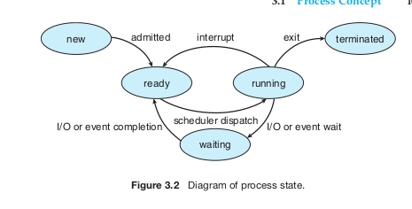
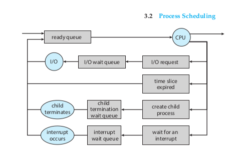
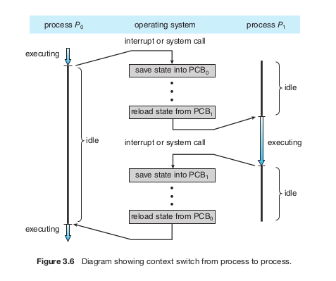
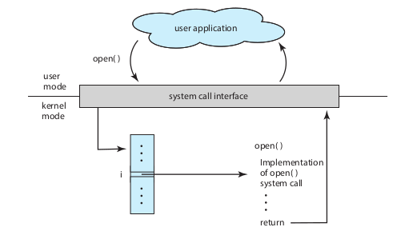

Un **programa** es una **entidad pasiva o inactiva** que consiste en un **conjunto o unidad de instrucciones** de software creadas para realizar una tarea específica en una computadora. Físicamente, un programa suele almacenarse en el disco de almacenamiento secundario en forma de archivo ejecutable.

Un programa normalmente se presenta en dos estados o formatos principales:

* **Código fuente:** Es la versión que escribe el programador en un lenguaje de programación de alto nivel (como C o Java). Se compone de líneas de texto en formato ASCII que son legibles para los seres humanos.
* **Código de máquina (ejecutable binario):** Dado que el procesador (CPU) no puede ejecutar directamente el código de alto nivel, un programa llamado **compilador** traduce este código fuente en una secuencia de instrucciones binarias de bajo nivel (ceros y unos). Estas instrucciones de máquina se empaquetan en un archivo ejecutable estructurado en el disco, utilizando formatos estandarizados según el sistema operativo como

- **ELF** en Linux,
- **PE** en Windows o
- **Mach-O** en macOS)

## El contenido de un archivo de programa ejecutable

Un programa guardado como un archivo ejecutable en disco no es solo una lista desordenada de instrucciones; contiene una estructura organizada de información y metadatos necesaria para que el sistema operativo pueda construir un proceso en la memoria
. Esta estructura contiene

- Identificación del formato binario: Metadatos que describen el formato del archivo para que el núcleo (kernel) del sistema operativo sepa cómo interpretarlo
- Punto de entrada (entry-point address): La dirección de memoria donde se encuentra la primera instrucción que el procesador debe ejecutar al arrancar el programa
- Instrucciones de lenguaje de máquina: El código binario que codifica el algoritmo del programa
- Sección de datos: Valores iniciales para las variables del programa y constantes literales (como cadenas de texto)
- Tablas de símbolos y relocalización: Listas que describen las ubicaciones y los nombres de las funciones y variables del programa, útiles para la depuración y para resolver referencias en tiempo de ejecución
- Información de enlace dinámico: Referencias a las bibliotecas compartidas (como la biblioteca estándar de C, libc) que el programa necesitará cargar al ejecutarse

comandos para analizar un archivo ELF.

```
file demo_pid
file demo_pid.c
```

> El Position-Independent Code (PIC), o código independiente de posición, es código máquina diseñado para poder ejecutarse correctamente sin importar en qué dirección de memoria sea cargado. Es decir, el programa no depende de que una función, variable o instrucción esté ubicada en una dirección absoluta específica. En lugar de asumir direcciones fijas, el código utiliza normalmente direcciones relativas, por ejemplo, calculando la ubicación de una función o dato a partir de la posición actual del programa.

El archivo **/lib64/ld-linux-x86-64.so.2** es el **enlazador y cargador dinámico en tiempo de ejecución** (comúnmente conocido como `ld.so`) para sistemas Linux con arquitectura x86-64 de 64 bits.

1. ¿Por qué se le llama "Intérprete"?

En el formato binario **ELF** (el estándar de archivos ejecutables y compartidos en Linux), un archivo ejecutable que depende de bibliotecas dinámicas define un "intérprete" a través de un elemento en su cabecera llamado `PT_INTERP`.

Cuando intentas ejecutar un programa de este tipo:

* El núcleo (*kernel*) del sistema operativo lee esta cabecera y, en lugar de cargar el programa directamente, construye la imagen del proceso utilizando los segmentos del archivo del **intérprete especificado** (en este caso, `/lib64/ld-linux-x86-64.so.2`).
* Una vez cargado, la responsabilidad de buscar, mapear en memoria y finalmente dar paso a la ejecución del programa principal recae completamente sobre este cargador dinámico.

2. ¿Cuál es su función principal?

Dado que los programas enlazados dinámicamente no incluyen el código de las bibliotecas que utilizan (como la biblioteca estándar de C, `libc`), este intérprete realiza las siguientes tareas esenciales en el momento del arranque:

* **Localizar las dependencias:** Examina la lista de bibliotecas requeridas por el programa (registradas en etiquetas `DT_NEEDED` dentro del ejecutable).
* **Cargar en memoria virtual:** Busca los archivos físicos de esas bibliotecas en el sistema y los mapea en el espacio de direcciones virtuales del proceso.
* **Relocalizar símbolos:** Modifica las referencias internas del programa para que las llamadas a funciones y accesos a variables apunten a las direcciones reales de memoria donde se acaban de cargar las bibliotecas.

**readelf**: Analizar las secciones y cabeceras internas del ELF

Es una herramienta diseñada específicamente para desglosar la estructura de un archivo ELF.

* **Ver encabezados** :

```
readelf -h demo_pid
readelf -a demo_pid
```

* **Ver encabezado de programa** :

```
readelf -l demo_pid
```

* **Ver la tabla de símbolos** (funciones y variables asociadas al binario):

```
readelf -s demo_pi
```

* **Inspeccionar la sección dinámica** (para ver etiquetas de dependencias y bibliotecas compartidas):

```
readelf -d demo_pid
``` [3]
```

**objdump**: Inspeccionar cabeceras e instrucciones de máquina desensambladas

Esta herramienta es sumamente versátil para obtener información detallada y el código desensamblado del binario:

* **Desensamblar el código** (traducir el código binario de máquina a lenguaje ensamblador para analizar la lógica de sus funciones):

```
objdump -d demo_pid
```

* **Inspeccionar todas las cabeceras** (por ejemplo, buscando referencias de relocalización en tiempo de ejecución o registros `TEXTREL`):

```
objdump --all-headers demo_pid | grep TEXTRE

```

4. **nm**: Listar los símbolos definidos y referenciados

El comando **nm** te permite listar el conjunto de símbolos (nombres de funciones y variables globales) que están definidos o que se necesitan importar en `demo_pid`:

```
nm demo_pid
```

* **Buscar un símbolo específico** (por ejemplo, para comprobar si tiene soporte para código independiente de la posición buscando la tabla global de offsets):

```bash
    nm demo_pid | grep _GLOBAL_OFFSET_TABLE_
```

### 5. **`ldd`**: Listar dependencias dinámicas

Para saber qué bibliotecas dinámicas (o compartidas, como `libc.so`) necesita el ejecutable `demo_pid` para arrancar, se utiliza el comando **`ldd`** [8]:

```bash
ldd demo_pid
```

### 6. **`size`**: Determinar el tamaño de los segmentos lógicos de memoria

El comando **`size`** muestra el tamaño en bytes de las secciones lógicas principales que compondrán el proceso en memoria cuando `demo_pid` sea cargado [9, 10]:

```bash
size demo_pid
```

Esto te reportará de forma resumida el tamaño de las secciones de **`text`** (código ejecutable), **`data`** (variables globales inicializadas) y **`bss`** (variables globales no inicializadas) [9, 11].

### 7. **`gdb`**: Depuración y análisis dinámico

Si necesitas ir más allá del análisis estático y observar cómo se comporta el binario en ejecución paso a paso, puedes iniciar el depurador de GNU (**`gdb`**) [12, 13]:

```bash
gdb demo_pid
```

Dentro de GDB, puedes establecer puntos de interrupción (`break`) [14], examinar registros de la CPU (`info registers`) [15] o desensamblar funciones específicas (`disas`) [16].

```

```

El **Bloque de Control de Proceso (PCB)**, también conocido en algunos sistemas como Bloque de Control de Tareas o descriptor de proceso (`task_struct` en Linux), es la estructura de datos que utiliza el sistema operativo para almacenar toda la información asociada a un proceso específico. Funciona como el "pasaporte" de un proceso y actúa como el repositorio central con los datos necesarios para iniciar, suspender o reanudar su ejecución en cualquier momento.

De acuerdo con las fuentes, la información contenida en el PCB se clasifica en las siguientes categorías principales:

1. Identificación del Proceso

* **Identificador de Proceso (PID):** Un número entero único asignado por el sistema que identifica al proceso de forma global e inmutable.
* **Identificadores de Relación:** Punteros o IDs que indican la jerarquía del proceso, como el PID del proceso padre (PPid), procesos hijos (*children*) y procesos hermanos (*siblings*).

2. Estado de Ejecución y Control de Flujo

* **Estado del Proceso (****Process State****):** Indica la condición actual en su ciclo de vida (por ejemplo: nuevo, listo, en ejecución, en espera/bloqueado o terminado).



4. Información de Planificación (*CPU Scheduling*)

* **Prioridad:** El nivel de prioridad asignado al proceso para determinar su turno de ejecución frente a otros en la cola de listos (*Ready Queue*).
* **Métricas del Planificador:** Parámetros como la cantidad de tiempo de CPU consumido recientemente, tiempo de espera en colas o el tiempo transcurrido desde que estuvo durmiendo.
* **Punteros a Colas:** Referencias para enlazar el PCB dentro de las listas encadenadas de planificación del sistema operativo.





5. Gestión de Memoria (*Memory-Management*)

* **Límites de Memoria:** Los valores de los registros base y límite (en sistemas sencillos) que determinan el rango físico o virtual asignado al proceso.
* **Tablas de Traducción de Direcciones:** Punteros a las tablas de páginas o tablas de segmentos del espacio de direcciones virtuales del proceso (necesarias para el mapeo de memoria en la MMU).
* **Límites de los Segmentos:** Punteros a las secciones de código (*text segment*), datos e imagen en disco si el proceso está paginado o fuera de la memoria RAM.

6. Estado de E/S y Gestión de Archivos

* **Tabla de Descriptores de Archivos:** Un arreglo de punteros que el proceso utiliza para hacer referencia a los archivos que tiene actualmente abiertos en el sistema.
* **Recursos de E/S Asignados:** Lista de dispositivos de entrada/salida reservados exclusivamente para el proceso.
* **Contexto de Directorios:** Referencias al directorio raíz, directorio de trabajo actual y espacio de nombres (*namespaces*).

Un **descriptor de archivo** (*file descriptor* o `fd`) es un entero pequeño no negativo que el sistema operativo asigna a un proceso como un identificador o *handle* para referirse a un archivo, dispositivo o canal de comunicación abierto.

> Todo en linux un archivo. (Casi) todo se abstrae a objetos que realizan `open()`, `read()`, `write()` y `close()`

En los sistemas operativos tipo UNIX/Linux, donde los archivos regulares, los dispositivos de entrada/salida, las tuberías (*pipes*) y los conectores de red (*sockets*) se manejan bajo el mismo modelo de abstracción, los descriptores permiten interactuar con todos ellos de manera uniforme.

**Uso en llamadas al sistema (****System Calls****):** Una vez que un archivo o dispositivo es abierto, las aplicaciones no utilizan la ruta o nombre en texto para leer o escribir, sino el entero del descriptor mediante llamadas como `read()`, `write()`, `lseek()` y `close()`

7. Contabilidad y Recursos (*Accounting*)

* **Estadísticas de Uso:** Tiempo de CPU total consumido (tanto en modo usuario como en modo sistema/núcleo), tiempo transcurrido desde que se inició el proceso y límites de tiempo de ejecución.
* **Límites de Recursos:** Cuotas impuestas al proceso, como el tamaño máximo permitido para su pila de usuario, número de descriptores de archivos que puede abrir o la cantidad de marcos de página físicos que puede consumir.
* **Datos de Facturación:** Números de cuenta de usuario y de trabajo con fines de cobro o auditoría del sistema.

8. Seguridad y Credenciales

* **Identificadores de Usuario y Grupo (UID / GID):** Identifican al propietario del proceso y su grupo para validar los permisos de acceso a archivos u otros recursos del sistema.

9. Control de Señales

* **Máscaras de Señales:** Registros que definen qué señales de software del sistema operativo están siendo ignoradas, cuáles están bloqueadas temporalmente, cuáles se deben capturar (*caught*) mediante manejadores específicos, y cuáles están pendientes de entrega.

10. Pila del Núcleo (*Kernel Stack*)

* Una pila de tamaño fijo reservada en el espacio de memoria del núcleo que es utilizada exclusivamente por las funciones del kernel cuando actúan en representación del proceso (por ejemplo, durante la ejecución de llamadas al sistema o control de interrupciones).

```bash
ls /proc

pstree -p
```

## Thread control block

El **Bloque de Control de Hilo** (**TCB**, por sus siglas en inglés *Thread Control Block*) es la estructura de datos que utiliza el sistema operativo para gestionar y realizar el seguimiento del estado y las características individuales de cada hilo de ejecución.

A diferencia del PCB (que almacena los recursos del proceso completo), el TCB contiene la información privada requerida para la ejecución independiente de un hilo en la CPU.

* **Identificación del Hilo (****Thread Identification / TID****):** Un identificador único asignado por el planificador de procesos en el momento en que se crea el hilo.
* **Estado del Hilo (****Thread State****):** La condición actual de ejecución del hilo (como `READY`, `RUNNING`, `WAITING` / `BLOCKED`, `DELAYED` o `FINISHED`), la cual cambia a medida que el hilo progresa.
* **Información de la CPU y Estado de Cómputo (****CPU Information****):**

3. Contexto de Registros de la CPU

Cuando el proceso es interrumpido (por ejemplo, por un cambio de contexto o una interrupción de hardware), se debe salvaguardar el estado exacto de la CPU dentro del PCB para poder restaurarlo más tarde. Esto incluye:

* **Registros Generales:** Acumuladores, registros de propósito general, registros de índice y punteros de pila.
* **Palabra de Estado del Programa (****Program Status Word**** - PSW):** Registro especial que contiene los códigos de condición (banderas de resultado como cero, signo, desbordamiento) y el modo de ejecución (usuario o kernel).

  ```bash
  gdb ./demo_pid
  break main
  run
  info registers eflags
  print/t $eflags
  ```

  * **Contador de Programa (****Program Counter**** - PC):** La dirección de la instrucción específica que el hilo está ejecutando o ejecutará a continuación.
  * **Registros del Procesador (****Saved Registers****):** Copia del contenido de los registros generales y especiales de la CPU guardados cuando el hilo no está activo, los cuales se restauran al reanudar su ejecución durante un cambio de contexto.
* **Información de la Pila (****Stack Information****):** Punteros a la pila privada del hilo (*stack pointer*), la cual almacena las variables locales, argumentos y direcciones de retorno de las llamadas a funciones en curso.
* **Prioridad del Hilo (****Thread Priority****):** El peso o nivel de prioridad del hilo en relación con otros hilos, utilizado por el planificador para determinar cuál seleccionar de la cola de listos.
* **Punteros de Relación y Proceso (****Process & Sub-Thread Pointers****):**

  * **Puntero al Proceso Padre (****Process Pointer****):** Referencia o puntero que indica el proceso al que pertenece el hilo.
  * **Punteros a Sub-hilos (****Sub-Thread Pointers****):** Referencias a otros sub-hilos creados directamente por este hilo.
* **Metadatos de Gestión (****Thread Metadata****):** Datos de administración empleados por el sistema para alojar el TCB en colas de planificación o en listas de espera de variables de sincronización.

# llamadas al sistema

Las **llamadas al sistema** (*system calls*) son el mecanismo y la interfaz que permiten a un programa de usuario solicitar servicios ofrecidos por el sistema operativo. Representan el único punto de entrada legal hacia el núcleo (*kernel*) para acceder a los recursos del sistema.

---

1. ¿Por qué existen?

* **Protección y seguridad:** Para evitar que un programa de aplicación o un usuario malintencionado cause fallos en el sistema o interfiera con otros procesos, el hardware y el sistema operativo no permiten que las aplicaciones en modo usuario accedan directamente al hardware o a la memoria del sistema.
* **Abstracción:** Proporcionan un mecanismo uniforme y simplificado para manipular dispositivos físicos y lógicos (como discos, pantallas o conexiones de red) sin que el programador necesite conocer los detalles complejos del hardware subyacente.

---

2. ¿Cómo funcionan? (Cambio de Modo)

Las CPU modernas operan al menos en dos modos de ejecución: **modo usuario** (*user mode*, sin privilegios) y **modo núcleo** (*kernel mode*, con acceso completo al hardware).

* Cuando un programa requiere ejecutar una acción protegida (por ejemplo, leer un archivo), realiza una llamada al sistema.
* La llamada al sistema desencadena una instrucción especial de máquina conocida como **trampa** (*trap*) o **interrupción de software**.
* El hardware cambia el bit de modo a modo núcleo (modo privilegiado) y transfiere el control a un manejador de trampas dentro del sistema operativo.
* El núcleo verifica la validez y los permisos de los parámetros enviados, ejecuta el servicio solicitado y devuelve el control al programa en modo usuario.


---

3. Principales categorías de llamadas al sistema

Las llamadas al sistema se clasifican comúnmente en seis categorías principales:

* **Control de procesos:** Creación y terminación de procesos, carga, ejecución, suspensión, obtención o modificación de atributos de un proceso y asignación de memoria (ej. `fork()`, `exec()`, `exit()`, `wait()`).
* **Gestión de archivos:** Crear, borrar, abrir, cerrar, leer, escribir, reposicionar el puntero y gestionar atributos o permisos de archivos y directorios (ej. `open()`, `read()`, `write()`, `close()`).
* **Gestión de dispositivos:** Solicitar o liberar dispositivos (como unidades de disco o impresoras), leer, escribir y configurar sus parámetros (ej. `ioctl()`).
* **Mantenimiento de información:** Consultar o establecer la hora y fecha del sistema, obtener métricas de rendimiento, datos del sistema o atributos de procesos y archivos.
* **Comunicaciones:** Crear y eliminar conexiones de red o canales IPC, enviar y recibir mensajes o paquetes entre procesos locales o remotos (ej. `socket()`, `pipe()`, `send()`, `receive()`).
* **Protección:** Controlar y modificar los permisos de acceso a los recursos del sistema y manejar credenciales de usuario.


https://math.hws.edu/eck/cs220/f22/registers.html
https://www.eecg.utoronto.ca/~amza/www.mindsec.com/files/x86regs.html
https://wiki.osdev.org/CPU_Registers_x86-64


https://blog.rchapman.org/posts/Linux_System_Call_Table_for_x86_64/