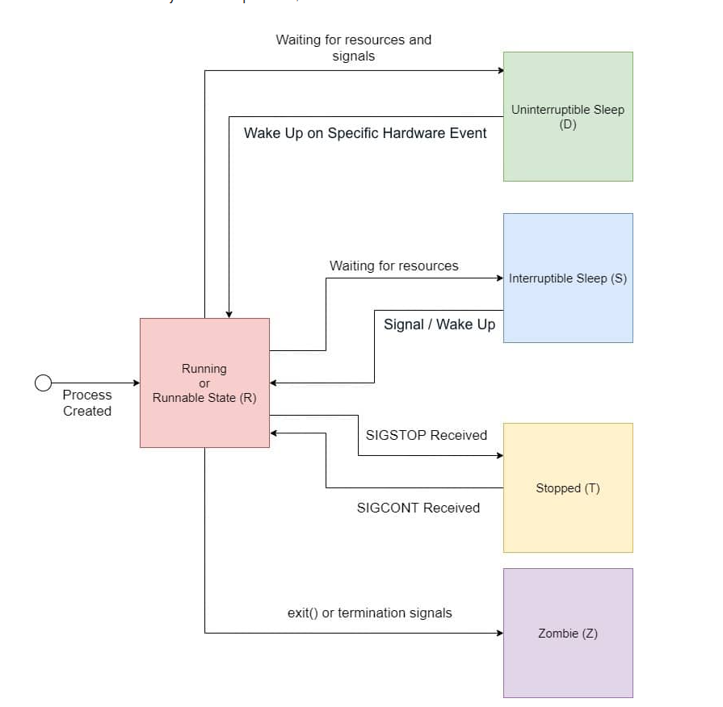

# Semana 2 — File descriptors, sockets e I/O bloqueante

**Curso:** Sistemas Operativos (16 semanas)
**Proyecto:** MiniServ — servidor TCP/HTTP multiproceso en C sobre Linux
**Duración:** 1 clase × 120 minutos

**Pregunta central de la semana:**

> MiniServ V0 imprime y termina. ¿Cómo puede un **mismo proceso** quedarse vivo esperando clientes, y qué ocurre en el kernel cuando `read()` no tiene datos todavía?

---

# A. Visión general de la semana

## Objetivos de aprendizaje

Al terminar la semana, el estudiante podrá:

1. **Explicar** qué es un file descriptor y cómo el kernel lo usa como índice hacia recursos abiertos (archivos, pipes, sockets, terminales).
2. **Identificar** el rol de stdin (0), stdout (1) y stderr (2) y cómo `read`/`write`/`close` operan sobre cualquier fd válido.
3. **Describir** el comportamiento de I/O **bloqueante**: cuándo una syscall se detiene, qué hace el scheduler y por qué el proceso pasa a estado blocked.
4. **Implementar** la secuencia `socket` → `bind` → `listen` → `accept` para obtener file descriptors de red en un proceso único.
5. **Diagnosticar** con `strace`, `ss` y `lsof` qué syscalls ejecuta un servidor al escuchar y al atender una conexión.
6. **Analizar** por qué un servidor secuencial atiende un solo cliente a la vez y qué limitación de concurrencia deja abierta para la Semana 3.
7. **Implementar** MiniServ V1: servidor TCP secuencial que acepta conexiones, lee bytes del cliente y los devuelve (echo).

## Motivación

**Problema concreto:** MiniServ V0 arranca, escribe `MiniServ iniciado` con `write(1, …)` y termina. Eso demostró procesos y syscalls, pero un servidor real debe **permanecer en ejecución** y **esperar** eventos externos: que alguien se conecte por red y envíe datos.

**Por qué importa en Sistemas Operativos:** la pregunta ya no es solo “¿quién escribe?”, sino “¿qué hace el proceso — y el scheduler — cuando **no hay nada que leer todavía**?”. Eso nos lleva a file descriptors como abstracción unificada, I/O bloqueante y sockets como recurso administrado por el kernel, no como “magia de redes”.

**Manifestación en MiniServ:** si convertimos MiniServ en listener TCP, la primera llamada a `accept()` puede **bloquearse** minutos enteros hasta que llegue un cliente. Mientras tanto, el proceso no consume CPU en un bucle vacío: el kernel lo pone en estado **blocked** hasta que haya una conexión pendiente.

**Mecanismo del SO que estudiaremos:** file descriptors + syscalls de I/O (`read`, `write`, `close`) + creación de sockets (`socket`, `bind`, `listen`, `accept`) + semántica bloqueante de esas llamadas.

## Conexión con semanas anteriores

```text
Semana 1: proceso + syscall write + strace
              │
              ▼
problema: MiniServ termina; no escucha ni espera
              │
              ▼
Semana 2: fds + read/write/close + blocking I/O + sockets
              │
              ▼
MiniServ V1: servidor TCP secuencial (un cliente a la vez)
              │
              ▼
Semana 3 (puente): un cliente lento bloquea a los demás → fork()
```

En la Semana 1 vimos que `write(1, …)` cruza al kernel y que `openat` devuelve un fd nuevo. Esta semana **profundizamos** en esa abstracción y la extendemos a la red. No repetimos la arquitectura user/kernel; la **usamos** cada vez que trazamos `read` o `accept`.

---

# 7. Clase — 120 minutos

**Planeación temporal (referencia para el profesor):**


| Tiempo       | Hilo narrativo                                            |
| ------------ | --------------------------------------------------------- |
| 0–10 min    | Problema motivador: MiniServ debe quedarse vivo y esperar |
| 10–25 min   | File descriptors: la tabla del proceso                    |
| 25–40 min   | `read`, `write`, `close` en profundidad                   |
| 40–55 min   | I/O bloqueante: qué hace el kernel cuando no hay datos   |
| 55–75 min   | Sockets:`socket`, `bind`, `listen`, `accept`              |
| 75–95 min   | Laboratorio: MiniServ V1 + observación con herramientas  |
| 95–110 min  | Ejercicios, predicción y discusión                      |
| 110–120 min | Síntesis, milestone y puente a la Semana 3               |

---

## Bloque 1 — Problema motivador (0–10 min)

**Qué explicar:** retomar MiniServ V0. Un servidor de verdad no imprime y muere: **escucha** un puerto, **acepta** conexiones y **lee/escribe** bytes. Todo eso son syscalls sobre file descriptors.

**Ejemplo en pizarrón:**

```text
Cliente (otro proceso / otra máquina)
        │ bytes por la red
        ▼
   NIC + stack TCP del kernel
        │
        ▼
   fd del socket conectado en MiniServ
        │
        ▼
   read() / write()  ← mismas syscalls que con archivos
```

**Preguntas al grupo:**

1. ¿MiniServ V0 realizaba alguna syscall que *esperara* un evento externo? (No: solo `write` y salida.)
2. Si un programa hace `while(1);` vacío, ¿está “esperando” eficientemente? (No: consume CPU — contraste con blocking I/O.)
3. ¿Puede nuestro proceso abrir directamente el puerto 8080 como si fuera un archivo en disco? (No: debe pedirlo al kernel vía `socket`/`bind`.)

**Conexión MiniServ:** hoy MiniServ pasará de “proceso que arranca y termina” a “proceso que **bloquea** en `accept()` hasta que alguien llame”.

---

## Bloque 2 — File descriptors (10–25 min)

**Qué explicar:**

- Un **file descriptor** (fd) es un entero `≥ 0`: índice en la **tabla de descriptores del proceso**.
- El kernel mantiene, por cada fd, una referencia a un **objeto abierto** (archivo, pipe, socket, dispositivo).
- El proceso **no** ve rutas ni direcciones IP en la syscall: solo el número.
- Al nacer, todo proceso hereda **0 = stdin**, **1 = stdout**, **2 = stderr**.

**Dibujo en pizarrón:**

```text
Proceso MiniServ
┌─────────────────────────────┐
│ fd 0 ──► terminal (stdin)   │
│ fd 1 ──► terminal (stdout)  │
│ fd 2 ──► terminal (stderr)  │
│ fd 3 ──► socket listening   │  ← después de socket+bind+listen
│ fd 4 ──► socket conectado   │  ← después de accept()
└─────────────────────────────┘
         │
         │ syscalls read/write/close(fd, ...)
         ▼
      Kernel
```

**Demostración rápida:** ejecutar `demo_fd.c` de la Semana 1 o la variante `demo_fds_std.c` (ver sección 11). Mostrar que `write(1, …)` y `write(archivo_fd, …)` usan la **misma** syscall con distinto fd.

**Pregunta conceptual (integrada):**

> ¿El fd es el archivo en disco?

**Respuesta esperada:** No. Es un handle en la tabla del **proceso**. Dos procesos pueden tener fd `3` apuntando a recursos distintos. Tras `close(3)`, el kernel puede reasignar el número 3 a otro recurso.

**Error frecuente (introducir aquí):** confundir fd con pathname. Corregir: `open("/tmp/x")` devuelve un entero; las operaciones posteriores usan ese entero.

**Herramienta Linux (breve):** en otra terminal, con un proceso en ejecución:

```bash
ls -l /proc/<pid>/fd
```

Mostrar `0 -> /dev/pts/...`, `1 -> ...`. Relacionar con la tabla del proceso.

---

## Bloque 3 — `read`, `write`, `close` (25–40 min)

**Qué explicar:**


| Syscall                 | Rol principal                                                                 |
| ----------------------- | ----------------------------------------------------------------------------- |
| `write(fd, buf, count)` | Copia bytes**desde user space hacia** el objeto del fd                        |
| `read(fd, buf, count)`  | Copia bytes**desde** el objeto del fd **hacia** user space                    |
| `close(fd)`             | Libera la entrada en la tabla del proceso; decrementa referencia en el kernel |

**Valores de retorno importantes:**

- `write` / `read` devuelven el **número de bytes transferidos**, o `-1` en error (`errno`).
- `read` que devuelve `0` en un socket o pipe: **fin de stream** (peer cerró escritura).
- Siempre verificar retorno; no asumir que se transfirió `count` completo en una sola llamada (tema que profundizaremos en Semana 14).

**Contraste** `printf` **vs** `write`**:** `printf` bufferiza en user space (stdio); `write` va al kernel inmediatamente. MiniServ usará `write` (o wrappers mínimos) para control explícito.

**Demostración:** compilar y ejecutar `demo_read_write.c` (sección 11). Trazar con:

```bash
strace -e trace=read,write,close ./demo_read_write
```

**Preguntas:**

1. ¿Cuántas veces cruza la frontera user/kernel un `write` de 100 bytes? (Una syscall; el kernel puede escribir menos de 100 en casos especiales.)
2. ¿Qué pasa si llamamos `read(999, …)` con un fd que no está abierto? (`EBADF`, retorno -1.)

**Conexión MiniServ:** atender un cliente será un ciclo `read(client_fd, …)` → procesar → `write(client_fd, …)` → eventualmente `close(client_fd)`.

---

## Bloque 4 — I/O bloqueante (40–55 min)

**Qué explicar:**

- Por defecto, `read` y `accept` en sockets son **bloqueantes**.
- Si no hay datos (o no hay conexión pendiente), la syscall **no retorna** de inmediato: el proceso pasa a estado **blocked**.
- El scheduler ejecuta otros procesos; cuando el kernel recibe datos o una conexión, despierta al proceso y la syscall completa.

**Diagrama — estados del proceso durante** `accept()`**:**

```text
MiniServ llama accept(listen_fd, ...)
        │
        ▼
¿ hay conexión en cola del socket? ──no──► proceso BLOCKED
        │                                      │
       sí                                      │ (scheduler corre otros)
        ▼                                      │
 devuelve client_fd ◄──────────────────────────┘
        │
        ▼
   estado RUNNABLE / RUNNING
```

**Experimento en vivo:** `demo_blocking_read.c` — proceso que hace `read(0, …)` y no imprime hasta que el usuario escriba en stdin. En otra terminal: `ps -o pid,state,cmd -p <pid>` → estado `S` (sleeping/interruptible).




**Contraste pedagógico:**

```c
while (1) { }           /* RUNNING: quema CPU */
read(fd, buf, n);      /* BLOCKED si no hay datos: eficiente */
```

**Pregunta de predicción (integrada):**

> MiniServ V1 está bloqueado en `accept()`. Llega un cliente. ¿MiniServ consume CPU mientras esperaba?

**Respuesta:** No de forma significativa en estado blocked. El costo aparece al despertar y procesar la conexión.

**Error frecuente:** “bloqueante = el programa se congeló/crasheó”. Corregir: es comportamiento **normal** y deseado en un servidor secuencial.

**Conexión profesional (breve):** servidores de producción combinan blocking, non-blocking y multiplexación (`poll`/`epoll`, Semana 13). Empezar con blocking hace visible el modelo de estados del proceso.

---

## Bloque 5 — Sockets (55–75 min)

**Qué explicar (solo lo necesario para SO):**

Definición en profundidad en **§9.5**. En pizarrón, resumir:

> Un **socket** es un objeto del kernel para comunicar bytes entre endpoints; en el proceso aparece como **file descriptor** y se usa con `read`/`write`/`close` como un archivo o stdin.

No es un curso de redes; nos interesa **cómo el kernel representa una conexión** y qué syscalls crean y usan esos fds.

**Secuencia servidor TCP (IPv4, simplificada):**

```text
socket()   → crea fd de socket (aún sin puerto local)
bind()     → asocia dirección/puerto local al fd
listen()   → marca fd como "escucha conexiones entrantes"
accept()   → bloquea hasta conexión; devuelve NUEVO fd conectado
read/write → sobre el fd devuelto por accept (no sobre listen_fd)
close()    → liberar fds cuando ya no se usen
```

**Dos fds importantes:**


| fd          | Rol                                      |
| ----------- | ---------------------------------------- |
| `listen_fd` | Puerta de entrada: solo`accept`          |
| `client_fd` | Conversación con**un** cliente concreto |

**Mínimo de redes (pizarrón):**

```text
127.0.0.1:8080  ← dirección IP + puerto (endpoint local)
      +
AF_INET, SOCK_STREAM  ← familia IPv4, byte stream confiable (TCP)
```

**Demostración (en dos pasos):** primero `demo_tcp_server_simple.c` (solo aceptar y enviar mensaje fijo); luego `demo_tcp_server.c` (echo con read/write). Levantar servidor, conectar con:

```bash
nc 127.0.0.1 8080
# o
echo "hola" | nc 127.0.0.1 8080
```

Trazar:

```bash
strace -e trace=network,socket,bind,listen,accept,read,write,close ./demo_tcp_server
```

**Herramientas en paralelo:**

```bash
ss -ltnp | grep 8080      # socket en LISTEN y proceso dueño
lsof -i :8080             # qué proceso tiene el puerto
```

**Preguntas:**

1. ¿Por qué `accept` devuelve un **nuevo** fd en lugar de reutilizar `listen_fd`? (Separar escucha de la conversación con un cliente; el listen_fd sigue disponible para más conexiones.)
2. ¿Qué syscall bloquea si no hay clientes? (`accept`, no `listen`.)

**Error frecuente:** hacer `read(listen_fd, …)` para obtener datos del cliente. Incorrecto: hay que `accept` primero.

**Historia (breve):** BSD Unix unificó sockets con el modelo “todo es un archivo” (~1983). Linux implementa la misma API POSIX que usará MiniServ.

---

## Bloque 6 — Laboratorio MiniServ V1 (75–95 min)

**Estado inicial:** MiniServ V0 — imprime y termina.

**Problema:** no escucha puerto ni atiende clientes.

**Mecanismo:** socket + bind + listen + accept + read/write + close.

**Cambio arquitectónico:**

```text
MiniServ V0 (main → printf → exit)
        │
        ▼
   necesita esperar clientes sin quemar CPU
        │
        ▼
   blocking accept + read/write sobre fds
        │
        ▼
MiniServ V1 (loop: accept → echo → close client_fd)
```

**Código de referencia:** [`miniserv/v1/src/server.c`](../miniserv/v1/src/server.c) (milestone entregable en carpeta `v1/`).

**Esqueleto guía para implementar en clase** (completar manejo de errores):

```c
/* miniserv/v1/src/server.c — MiniServ V1, servidor TCP secuencial echo */
#define _POSIX_C_SOURCE 200809L

#include <arpa/inet.h>
#include <errno.h>
#include <netinet/in.h>
#include <stdio.h>
#include <string.h>
#include <sys/socket.h>
#include <unistd.h>

#define PORT 8080
#define BACKLOG 8
#define BUF_SIZE 4096

static void die(const char *msg)
{
    perror(msg);
    _exit(1);
}

int main(void)
{
    int listen_fd, client_fd;
    struct sockaddr_in addr;
    socklen_t addrlen = sizeof(addr);
    char buf[BUF_SIZE];
    ssize_t n;

    listen_fd = socket(AF_INET, SOCK_STREAM, 0);
    if (listen_fd < 0)
        die("socket");

    int opt = 1;
    if (setsockopt(listen_fd, SOL_SOCKET, SO_REUSEADDR, &opt, sizeof(opt)) < 0)
        die("setsockopt");

    memset(&addr, 0, sizeof(addr));
    addr.sin_family = AF_INET;
    addr.sin_addr.s_addr = htonl(INADDR_ANY);
    addr.sin_port = htons(PORT);

    if (bind(listen_fd, (struct sockaddr *)&addr, sizeof(addr)) < 0)
        die("bind");
    if (listen(listen_fd, BACKLOG) < 0)
        die("listen");

    const char *banner = "MiniServ V1 escuchando en puerto 8080\n";
    if (write(STDERR_FILENO, banner, strlen(banner)) < 0)
        die("write");

    for (;;) {
        client_fd = accept(listen_fd, (struct sockaddr *)&addr, &addrlen);
        if (client_fd < 0) {
            if (errno == EINTR)
                continue;
            die("accept");
        }

        while ((n = read(client_fd, buf, sizeof(buf))) > 0) {
            ssize_t off = 0;
            while (off < n) {
                ssize_t w = write(client_fd, buf + off, (size_t)(n - off));
                if (w < 0)
                    die("write");
                off += w;
            }
        }
        if (n < 0)
            perror("read");

        close(client_fd);
    }
    /* unreachable */
}
```

**Actividad guiada:**

1. Actualizar `Makefile` si hace falta (mismos flags; puede añadirse `-D_POSIX_C_SOURCE`).
2. Compilar y ejecutar `./miniserv`.
3. Terminal 2: `nc 127.0.0.1 8080`, escribir texto, ver echo.
4. Terminal 3: conectar **segundo** cliente mientras el primero mantiene la conexión — observar que **espera** (limitación secuencial).
5. `strace -p <pid>` mientras llega un cliente: ver secuencia `accept` → `read` → `write`.

**Observación pedagógica clave:** con dos clientes, el segundo queda en cola en el kernel hasta que el primero cierra. **No es bug:** es la semántica de un servidor secuencial con un solo hilo de ejecución. Semana 3: `fork()`.

---

## Bloque 7 — Ejercicios, predicción y cierre de clase (95–120 min)

### Ejercicio corto 1 — Contador de bytes (10–15 min)

**Enunciado:** programa que lee stdin byte a byte con `read(0, &c, 1)` hasta EOF y escribe en stderr cuántos bytes leyó.

**Objetivo:** practicar loop con `read` y fd 2.

**Solución profesor:** ver `demo_byte_count.c` en sección 11.

---

### Ejercicio corto 2 — Puerto configurable (15–20 min)

**Enunciado:** modificar MiniServ V1 para leer el puerto desde `argv[1]` (default 8080). Validar que sea número 1–65535.

**Objetivo:** separar configuración sin introducir `fork`.

---

### Actividad de predicción

**Código:**

```c
int fd = open("/tmp/x", O_RDONLY);
char buf[4];
ssize_t a = read(fd, buf, 4);
ssize_t b = read(fd, buf, 4);
printf("a=%zd b=%zd\n", a, b);
```

Archivo `/tmp/x` contiene exactamente 6 bytes.

**Preguntas:** ¿Valores de `a` y `b`? ¿Posición en el archivo tras cada `read`?

**Respuesta:** `a=4`, `b=2`. El kernel mantiene un **offset** por fd abierto; cada `read` avanza. En sockets TCP el offset no es visible como en archivos, pero la idea de “stream de bytes” es análoga.

**Determinismo:** tamaños sí; timing de red no.

---

### 3 preguntas conceptuales (cierre)

**1.** ¿Por qué `close(client_fd)` no cierra el servidor completo?

**Respuesta:** Solo libera el fd de **esa** conexión. `listen_fd` sigue abierto y el loop puede llamar `accept` de nuevo.

**2.** ¿Un servidor bloqueado en `accept()` está “haciendo nada útil”?

**Respuesta:** Está esperando trabajo I/O-bound de forma eficiente. Útil para un solo cliente; insuficiente para concurrencia (Semana 3).

**3.** ¿`socket()` ya abre una conexión de red?

**Respuesta:** No. Crea un endpoint del kernel. Conexión implica `connect` (cliente) o `accept` (servidor tras `listen`).

---

# 9. Explicación teórica

## 9.1 File descriptors

**Qué es:** entero pequeño que indexa la tabla de descriptores abiertos del proceso.

**Por qué existe:** unificar acceso a recursos heterogéneos (archivos, pipes, sockets, dispositivos) bajo las mismas syscalls `read`/`write`/`close`.

**Problema que resuelve:** el programa no necesita saber si escribe a disco, terminal o red; pide al kernel “escribe en el fd 4”.

**Cómo funciona:** al `open`/`socket`/`accept`, el kernel asigna la primera entrada libre en la tabla del proceso y incrementa contadores internos del objeto.

**Rol del kernel:** guarda la tabla por proceso, valida fds en cada syscall, traduce fd → objeto concreto (VFS, socket struct, etc.).

**MiniServ:** `listen_fd` y cada `client_fd` son filas distintas en esa tabla.

**Errores conceptuales:** pensar que cerrar el programa cierra automáticamente todos los fds (el kernel lo hace al exit, pero en servidores de larga vida hay que `close` explícitamente); reutilizar un fd después de `close` sin saber que el número puede reciclarse.

## 9.2 stdin, stdout, stderr

**Qué son:** fds 0, 1 y 2 heredados del padre (normalmente la shell). Conectan el proceso con terminal o redirecciones.

**Por qué existen:** convención POSIX para entrada/salida/diagnóstico sin hardcodear rutas.

**MiniServ:** mensajes de log del servidor pueden ir a stderr (`fd 2`) para no mezclarse con datos enviados al cliente por el socket.

**Error frecuente:** mezclar logs con `write(client_fd, …)` — el cliente recibiría basura de depuración.

## 9.3 `read`, `write`, `close`

**Qué son:** syscalls de I/O genéricas sobre fds.

**Por qué existen:** interfaz uniforme heredada de Unix (“everything is a file”).

**Kernel:** copia datos entre user buffer y kernel buffers/subsystems; para sockets, integra con stack TCP.

**MiniServ:** eco de peticiones = pares read/write sobre `client_fd`.

**Errores:** ignorar retorno; asumir mensaje completo en un solo `read` (TCP es stream: un mensaje puede partirse en varios `read`).

## 9.4 I/O bloqueante

**Qué es:** syscall que no retorna hasta que la operación puede progresar (o ocurre error/señal).

**Por qué existe:** modelo simple: el programador escribe código secuencial sin polling.

**Problema que resuelve:** evitar bucles ocupados (`while(!hay_datos)`).

**Scheduler:** proceso en blocked no compite por CPU; pasa a runnable cuando el kernel marca el fd como listo.

**MiniServ V1:** bloqueo en `accept` y en `read` cuando el cliente no envía.

**Errores:** confundir blocked con deadlock (deadlock es Semana 8, entre procesos que se esperan mutuamente con recursos).

## 9.5 ¿Qué es un socket?

En este curso un **socket** no se define como “protocolo de internet” ni como “HTTP”. Es un **objeto del kernel** que representa un **punto de comunicación** — una forma de enviar y recibir bytes entre dos participantes (dos procesos en la misma máquina, o procesos en máquinas distintas conectadas por red).

### Definición operativa (la que usa MiniServ)

> Un **socket** es un recurso administrado por el kernel que el proceso manipula mediante un **file descriptor**, usando las mismas syscalls `read`, `write` y `close` que ya conoce de archivos y terminales.

Esa unificación no es casual: en Unix/Linux heredamos la idea de que casi todo I/O pasa por **fds** y syscalls genéricas. El socket es **otro tipo de objeto** detrás del entero, igual que un archivo regular o un pipe lo es detrás de su fd.

### Qué problema resuelve desde Sistemas Operativos

Sin sockets (o mecanismos equivalentes), cada programa tendría que hablar directamente con el hardware de red o con drivers propios. El kernel concentra:

- direcciones y puertos;
- colas de bytes (buffers de envío/recepción);
- el protocolo de transporte (en MiniServ usamos **TCP**, stream confiable de bytes);
- la decisión de **cuándo** un `read` o `accept` puede desbloquearse.

Desde user space solo vemos: **entero fd** + **syscalls**. El resto es responsabilidad del kernel — igual que con `write(1, …)` y la terminal.

### Cómo se ve en el proceso vs. en el kernel

```text
Proceso MiniServ (user space)
┌─────────────────────────────────────┐
│  fd 3  ──►  socket en modo LISTEN   │  ← escucha en puerto 8080
│  fd 4  ──►  socket conectado (TCP)  │  ← un cliente concreto
└─────────────────────────────────────┘
              │ read / write / accept
              ▼
Kernel
┌─────────────────────────────────────┐
│  struct socket, buffers, cola accept │
│  stack TCP (estado de conexiones)    │
│  NIC / loopback si hay tráfico real  │
└─────────────────────────────────────┘
```

El proceso **no** ve direcciones IP ni puertos como “variables mágicas” en cada `read`: ve **fds**. La dirección y el puerto se configuran una vez con `bind` (servidor) o `connect` (cliente); la conversación diaria es `read`/`write` sobre el fd conectado.

### Socket no es lo mismo que puerto ni que conexión

| Concepto | Qué es |
| -------- | ------ |
| **Socket** | Objeto del kernel; en el proceso, un fd |
| **Puerto** (p. ej. 8080) | Número lógico en la dirección local del socket; recurso compartido del sistema |
| **Conexión TCP** | Par de endpoints acoplados; en el servidor suele materializarse como **nuevo fd** tras `accept()` |
| **`listen_fd`** | Socket pasivo: solo acepta conexiones entrantes |
| **`client_fd`** | Socket conectado: por aquí van los bytes de **un** cliente |

**Error frecuente:** decir “el puerto 8080 es un fd”. El puerto se **asocia** al socket con `bind`; el fd es el handle del proceso hacia ese socket.

### Relación con file descriptors e I/O bloqueante

- Crear socket: `socket()` → nueva fila en la tabla de fds del proceso.
- Esperar cliente: `accept(listen_fd, …)` puede **bloquear** (proceso en estado sleeping) hasta que el kernel tenga una conexión lista.
- Intercambiar datos: `read`/`write` sobre el fd conectado; también pueden bloquear si no hay bytes disponibles o el buffer de envío está lleno.

Por eso MiniServ V1 — aunque “sea un servidor de red” — es sobre todo un estudio de **procesos**, **fds** e **I/O bloqueante**: el mismo patrón que `read(0, …)` en stdin, con otro tipo de objeto detrás del fd.

### Qué no necesitamos dominar esta semana (redes)

No hace falta diseñar protocolos ni estudiar routing. Basta con tres ideas mínimas:

1. **127.0.0.1** — loopback (tráfico que no sale de la máquina; útil en laboratorio).
2. **Puerto** — etiqueta para multiplexar muchos servicios en una IP.
3. **TCP stream** — secuencia de bytes sin mensajes delimitados por el kernel (un `read` puede traer parte de lo enviado).

El foco sigue siendo: **¿qué syscalls ejecuta el proceso y qué hace el kernel cuando bloquea o despierta?**

### Historia mínima (contexto)

La API de **sockets BSD** (~1983) unificó la programación de red con el modelo Unix. Linux expone la misma familia de syscalls (`socket`, `bind`, `listen`, `accept`, …) que usará MiniServ durante el semestre.

---

## 9.6 Syscalls de servidor sobre un socket

**Secuencia típica (servidor TCP):**

- `socket`: crea endpoint en el kernel; devuelve fd (aún sin puerto publicado).
- `bind`: asocia dirección IP + puerto local al fd (recurso del sistema).
- `listen`: socket pasivo; el kernel mantiene cola de conexiones pendientes.
- `accept`: bloquea hasta una conexión lista; devuelve **nuevo fd** para ese cliente.
- `read` / `write`: bytes sobre el fd conectado (no sobre `listen_fd`).
- `close`: libera fds; en V1 se cierra `client_fd` tras cada cliente y `listen_fd` sigue abierto en el loop.

**MiniServ V1:** un solo proceso ejecuta toda la secuencia; un cliente activo bloquea el siguiente `accept` hasta `close(client_fd)`.

**Errores frecuentes:** olvidar `htons`/`htonl` al llenar `struct sockaddr_in`; hacer `read(listen_fd, …)` en lugar de `accept` + `read(client_fd, …)`; omitir `close` y agotar fds (Semana 14).

---

# 10. Diagramas

## 10.1 Tabla de fds y kernel

```text
User space                    Kernel space
──────────                    ────────────
write(4, buf, n)  ──trap──►  validar fd 4
                                    │
                                    ▼
                              socket send buffer
                                    │
                                    ▼
                              stack TCP / NIC
```

**Explicación:** el número 4 es local al proceso; el kernel traduce a estructuras internas.

## 10.2 Servidor secuencial — dos clientes

```text
Tiempo ───────────────────────────────────────►

Cliente A conecta ──► accept ──► read/write A ──► close
Cliente B conecta ──► (espera en cola kernel) ──► accept ──► ...
```

**Explicación:** el kernel acepta la conexión de B en cola, pero MiniServ no llama `accept` hasta terminar con A.

## 10.3 Ciclo de vida de fds en MiniServ V1

```text
socket → listen_fd
              │
         bind/listen
              │
         accept → client_fd
              │
         read/write loop
              │
         close(client_fd) ──► listen_fd sigue vivo
              │
         accept (otra vuelta)
```

---

# 11. Demostraciones en C

Los archivos están en `programas_ejemplo/`. Resumen:

---

## 11.1 `demo_fds_std.c` — fds estándar

### Objetivo

Mostrar stdin/stdout/stderr como fds 0, 1, 2 y escritura con `write`.

### Código completo

Ver archivo `programas_ejemplo/demo_fds_std.c`.

### Compilación

```bash
gcc -Wall -Wextra demo_fds_std.c -o demo_fds_std
```

### Ejecución

```bash
./demo_fds_std
```

### Salida esperada

```text
stdin=0 stdout=1 stderr=2
esto va a stdout (fd 1)
esto va a stderr (fd 2)
```

### No determinismo

Ninguno en PIDs ni orden de líneas.

### Explicación paso a paso

1. Imprime constantes `STD*_FILENO`.
2. Cada `write` usa distinto fd → misma syscall, distinto destino en kernel.
3. Tres traps a kernel (`write`).
4. Terminal driver o pipe según redirección.

---

## 11.2 `demo_read_write.c` — copia archivo con read/write

### Objetivo

`open` → `read` loop → `write` loop → `close`; mismas syscalls servirán para sockets.

### Compilación

```bash
gcc -Wall -Wextra demo_read_write.c -o demo_read_write
```

### Ejecución

```bash
./demo_read_write /etc/hostname /tmp/copia-hostname
cat /tmp/copia-hostname
```

### Salida esperada

Contenido idéntico al archivo origen (p. ej. `ubuntu`).

### No determinismo

Ninguno.

### Explicación paso a paso

1. `open` devuelve fd de lectura.
2. `read` copia desde page cache del kernel al buffer user.
3. `write` copia al archivo destino.
4. `read` retorna 0 al EOF → termina loop.
5. `close` libera entradas.

---

## 11.3 `demo_blocking_read.c` — blocked en stdin

### Objetivo

Observar proceso en estado sleeping mientras `read(0, …)` espera.

### Compilación

```bash
gcc -Wall -Wextra demo_blocking_read.c -o demo_blocking_read
```

### Ejecución

```bash
./demo_blocking_read
# escribir una línea y Enter
```

### Salida esperada

```text
Esperando entrada (read bloqueante en stdin)...
Leí 5 bytes: hola
```

### No determinismo

Timing depende del usuario.

### Explicación paso a paso

1. Mensaje inicial con `write(2, …)`.
2. `read(0, …)` bloquea → proceso `S` en `ps`.
3. Usuario escribe → kernel despierta proceso → `read` retorna.
4. Segundo `write` muestra resultado.

---

## 11.4 `demo_tcp_server_simple.c` — TCP paso 1

### Objetivo

Secuencia socket/bind/listen/accept; dos fds; un `write` fijo al cliente (sin `read`).

### Compilación

```bash
gcc -Wall -Wextra demo_tcp_server_simple.c -o demo_tcp_server_simple
```

### Ejecución

Terminal 1:

```bash
./demo_tcp_server_simple
```

Terminal 2:

```bash
nc 127.0.0.1 9090
```

### Salida esperada (cliente)

```text
MiniServ demo: conexion aceptada.
```

### Explicación paso a paso

1. Cuatro syscalls configuran el listener (`listen_fd`).
2. `accept` bloquea hasta `nc`; devuelve `client_fd`.
3. Mensaje fijo por `write(client_fd, …)` — demuestra que los datos van por el fd conectado, no por `listen_fd`.
4. Siguiente demo: agregar `read` y echo.

---

## 11.5 `demo_tcp_server.c` — TCP paso 2 (echo)

### Objetivo

Secuencia completa socket/bind/listen/accept/read/write/close con echo.

### Compilación

```bash
gcc -Wall -Wextra demo_tcp_server.c -o demo_tcp_server
```

### Ejecución

Terminal 1:

```bash
./demo_tcp_server
```

Terminal 2:

```bash
echo hola | nc 127.0.0.1 9090
```

### Salida esperada (servidor)

```text
listen_fd=3
accept → client_fd=4
read 5 bytes, echo OK
```

(PIDs y números de fd pueden variar.)

### No determinismo

Números de fd; orden si varios clientes compiten.

### Explicación paso a paso

1. `socket` crea fd.
2. `bind`/`listen` registran puerto 9090 en kernel.
3. `accept` bloquea hasta `nc`.
4. `read`/`write` en `client_fd`.
5. `close` ambos fds al terminar demo (MiniServ mantiene `listen_fd`).

---

## 11.6 `demo_byte_count.c` — ejercicio de clase

### Objetivo

Contar bytes desde stdin con `read` de un byte.

### Compilación y ejecución

```bash
gcc -Wall -Wextra demo_byte_count.c -o demo_byte_count
echo abcde | ./demo_byte_count
```

### Salida esperada

```text
bytes leidos: 5
```

---

# 12. Herramientas Linux

## `strace`

**Observar:** secuencia `socket`, `bind`, `listen`, `accept`, `read`, `write`, `close` en MiniServ.

```bash
strace -f -e trace=network,socket,bind,listen,accept,read,write,close ./miniserv
```

**Identificar alumno:** `accept` bloqueante aparece como llamada que tarda; tras conectar con `nc`, retorna con fd nuevo.

## `ss`

**Observar:** socket en estado LISTEN y conexiones ESTAB.

```bash
ss -ltnp | grep 8080
ss -tnp  | grep miniserv
```

**Relación:** muestra objetos de red del kernel asociados al proceso.

## `lsof`

```bash
lsof -i :8080
lsof -p <pid>
```

**Identificar:** PID dueño del puerto; fds abiertos (`TCP *:8080 (LISTEN)`).

## `ps`

```bash
ps -o pid,state,wchan:20,cmd -p <pid>
```

**Observar:** estado `S` y `wchan` relacionado con `accept` o `read` cuando bloquea.

## `/proc/<pid>/fd`

```bash
ls -l /proc/<pid>/fd
```

**Identificar:** symlinks a `socket:[inode]` para fds de red.

---

# 13. Integración con MiniServ

## Estado inicial

MiniServ V0: compila, imprime `MiniServ iniciado`, termina. Conocemos procesos, syscalls y `write` a fd 1.

## Problema

No escucha puerto, no espera clientes, no demuestra I/O bloqueante ni fds de red.

## Mecanismo del Sistema Operativo

File descriptors + I/O bloqueante + API de sockets POSIX.

## Cambio arquitectónico

```text
MiniServ V0 (proceso efímero)
      │
      ▼
debe quedarse vivo y esperar conexiones sin busy-wait
      │
      ▼
blocking I/O + sockets (listen_fd / client_fd)
      │
      ▼
MiniServ V1 (servidor TCP secuencial echo)
```

**Versión del proyecto:** V1. HTTP llegará en V2 (Semana posterior o extensión); esta semana el protocolo es **bytes crudos** (echo TCP).

---

# 14. Milestone semanal — MiniServ V1

## Requisitos funcionales

- Al ejecutar `./miniserv`, el proceso permanece en ejecución.
- Escucha en TCP puerto 8080 (o el definido en clase).
- Por cada conexión entrante: lee bytes del cliente y los reenvía (echo) hasta que el cliente cierre.
- Tras cerrar un cliente, acepta otro.
- Escribe un mensaje de arranque en stderr (no en el socket del cliente).

## Requisitos técnicos

- Usar `socket`, `bind`, `listen`, `accept`, `read`, `write`, `close`.
- Compilar con `gcc -Wall -Wextra` vía Makefile.
- Manejo básico de errores con `perror` o función similar.
- IPv4 (`AF_INET`), `SOCK_STREAM`.

## Restricciones

- **No** usar `fork`, threads, señales, `select`/`poll`/`epoll`.
- **No** implementar HTTP completo todavía (opcional mencionar como mejora personal).
- Un solo proceso: arquitectura secuencial obligatoria.

## Criterios de aceptación

```text
[ ] Compila con -Wall -Wextra sin warnings
[ ] ./miniserv queda escuchando (no termina de inmediato)
[ ] nc 127.0.0.1 8080 recibe echo de lo enviado
[ ] strace muestra socket, bind, listen, accept, read, write
[ ] ss -ltnp muestra el puerto en LISTEN
[ ] Segundo cliente espera mientras el primero está conectado (demostrable)
[ ] close(client_fd) tras cada conexión; listen_fd permanece abierto
```

## Pruebas

```bash
cd miniserv/v1 && make

# Terminal 1
./miniserv

# Terminal 2
echo "ping" | nc 127.0.0.1 8080
# esperado: ping

# Terminal 3 (mientras T2 mantiene nc interactivo abierto)
nc 127.0.0.1 8080
# debe bloquear hasta cerrar la sesión en T2

# Observabilidad
strace -p $(pgrep -n miniserv) -e accept,read,write
ss -ltnp | grep 8080
```

---

# 15. Actividades de clase

(Incluidas en la sección 7; resumen para el profesor.)


| Tipo          | Cantidad | Ubicación en clase      |
| ------------- | -------- | ------------------------ |
| Conceptual    | 3+       | Bloques 2, 4, 5, 7       |
| Programación | 2        | Bloque 7                 |
| Predicción   | 1        | Bloque 7 (`read` offset) |

---

# 16. Errores y misconceptions

### "`read` siempre llena el buffer"

Incorrecto. Puede devolver menos bytes de los pedidos (archivos y sockets). Hay que usar el valor de retorno.

### "Cerrar MiniServ con Ctrl+C es lo mismo que `close(listen_fd)`"

Ctrl+C envía señal (Semana 5). `close` solo libera el fd. Hoy aceptamos Ctrl+C como atajo; cierre ordenado vendrá después.

### "El puerto es un fd"

El **puerto** es número lógico en la dirección del socket. El **fd** es handle del proceso hacia el objeto socket en el kernel.

### "`accept` lee datos del cliente"

`accept` crea conexión y devuelve fd. Los datos se leen con `read` sobre ese fd.

### "Blocking I/O = malo"

Es ineficiente **solo** cuando necesitamos atender muchos clientes simultáneos con un solo hilo. Es el modelo correcto para empezar y para cargas simples.

### "Sockets no son file descriptors"

En Unix/Linux, los sockets **son** fds: `read`/`write`/`close` aplican (con semántica de stream).

---

# 17. Conexión profesional

- **Apache/Nginx (modo inicial):** aceptan conexión y atienden; la evolución a worker pools (Semana 11) replica decisiones de servidores reales.
- `ss`**/**`lsof`**:** operadores usan estas herramientas para “¿quién tiene el puerto 443?” — mismo objeto kernel que estudiamos.
- **PostgreSQL:** cada sesión es conexión TCP → fd en el postmaster/backend; patrón accept/read/write.
- **Docker:** publicar puerto (`-p 8080:8080`) reenvía tráfico al fd del proceso en un namespace de red; el fd sigue siendo recurso del kernel visto por el contenedor.
- **systemd socket activation:** el supervisor puede pasar un `listen_fd` ya abierto al servicio — herencia de fds (anticipación Semana 4).

---

# 18. Historia y fun facts

1. **"Everything is a file"** (Thompson/Ritchie, Unix): unificar dispositivos, pipes y archivos bajo fds facilitó que MiniServ use `read`/`write` en TCP igual que en `/etc/hostname`.
2. **Sockets BSD (1983):** antes, APIs de red eran más ad hoc; sockets se integraron al modelo Unix y POSIX los estandarizó.
3. `nc` **(netcat):** herramienta de 1996 aún útil para generar tráfico controlado sin escribir un cliente — ideal para laboratorio de SO.
4. **Puerto bien conocidos:** 8080 como alternativa HTTP de desarrollo; en producción el kernel distingue listeners por `(IP, puerto, protocolo)`.

---

# 19. Tarea semanal

## Objetivo

Entregar MiniServ V1 funcional y reporte de observación con herramientas del SO.

## Descripción

1. Implementar servidor TCP echo según milestone.
2. Realizar experimentos con dos clientes simultáneos y documentar el comportamiento secuencial.
3. Capturar evidencia con `strace` y `ss`.

## Requisitos funcionales

- Echo TCP en puerto 8080 (o documentar otro).
- Mensaje de arranque en stderr.

## Requisitos técnicos

- Syscalls indicadas en milestone; sin `fork`/threads.

## Archivos a entregar

```text
miniserv/           (código, Makefile, README actualizado)
reporte-semana2.md
```

## Ejemplo de ejecución

```bash
make
./miniserv &
sleep 1
echo "test" | nc 127.0.0.1 8080
```

## Criterios de aceptación

```text
[ ] Milestone V1 completo
[ ] Reporte con captura strace (accept/read/write)
[ ] Reporte con ss -ltnp
[ ] Experimento dos clientes documentado
[ ] Respuestas a preguntas del reporte
```

## Preguntas para el reporte

1. ¿Qué diferencia observaste entre `listen_fd` y `client_fd` en `strace` o `/proc/<pid>/fd`?
2. ¿En qué estado apareció MiniServ mientras esperaba en `accept()`? ¿Cómo lo verificaste?
3. ¿Qué ocurrió con el segundo cliente mientras el primero seguía conectado? ¿En qué capa se encoló la conexión?
4. ¿Por qué un servidor secuencial no escala a miles de clientes simultáneos? (Un párrafo, sin proponer aún `fork`.)

## Empaquetado

```bash
tar czf miniserv-semana2.tar.gz miniserv/ reporte-semana2.md
```

---

# 20. Cierre de la semana

## Conceptos fundamentales

1. File descriptor = índice del proceso hacia un recurso del kernel.
2. stdin (0), stdout (1), stderr (2) son fds heredados.
3. `read`/`write`/`close` operan sobre cualquier fd válido.
4. I/O bloqueante = proceso en estado blocked sin consumir CPU en busy-wait.
5. Socket = recurso de red expuesto como fd.
6. Servidor: `socket` → `bind` → `listen` → `accept` → `read`/`write` → `close(client)`.
7. `accept` devuelve un **nuevo** fd por conexión; `listen_fd` permanece.
8. MiniServ V1 es secuencial: un cliente activo retrasa a los demás.
9. `strace`, `ss`, `lsof` y `/proc` muestran syscalls, puertos y fds.

## Mapa conceptual

```text
MiniServ debe esperar clientes
        │
        ▼
file descriptors + blocking read/accept
        │
        ▼
socket API (bind/listen/accept)
        │
        ▼
MiniServ V1 (TCP echo secuencial)
```

## Qué cambia en la siguiente semana

MiniServ V1 funciona, pero un cliente lento **bloquea** todo el servidor: nadie más es aceptado hasta que termine. Eso no es fallo del kernel; es falta de **concurrencia a nivel proceso**.

**Semana 3 — Creación y administración de procesos:** `fork()` para atender cada cliente en un proceso hijo, introducir `wait`/`waitpid` y el árbol de procesos de MiniServ.

**Pregunta que abre la Semana 3:**

> Si `accept` ya devuelve un fd listo para `read`, ¿por qué no duplicar el **proceso** entero para atender varios clientes en paralelo en lugar de duplicar solo el fd?

---

## Apéndice para el profesor

### Makefile sugerido (V1)

```makefile
CC      = gcc
CFLAGS  = -Wall -Wextra -std=c11 -D_POSIX_C_SOURCE=200809L
TARGET  = miniserv

$(TARGET): src/server.c
	$(CC) $(CFLAGS) src/server.c -o $(TARGET)

clean:
	rm -f $(TARGET)

.PHONY: clean
```

### Recapitulación de misconceptions


| Error frecuente            | Corrección breve                        |
| -------------------------- | ---------------------------------------- |
| fd = pathname              | fd = índice en tabla del proceso        |
| `accept` lee bytes         | `accept` crea fd conectado               |
| blocking = crash           | blocked = espera eficiente en el SO      |
| un puerto = un fd global   | puerto en socket; cada proceso tiene fds |
| sockets no usan read/write | sí, API unificada Unix                  |

### Puente visual hacia fork (no enseñar aún)

```text
Hoy:  [ MiniServ ] ──accept──► cliente A ──► cliente B (espera)

Semana 3:
        [ MiniServ padre ] ──accept──► fork ──► hijo atiende A
                              └──accept──► fork ──► hijo atiende B
```

Mantener **sin implementar** hasta la Semana 3; solo mostrar al cerrar para motivar.
