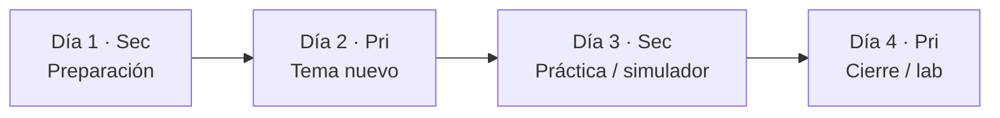
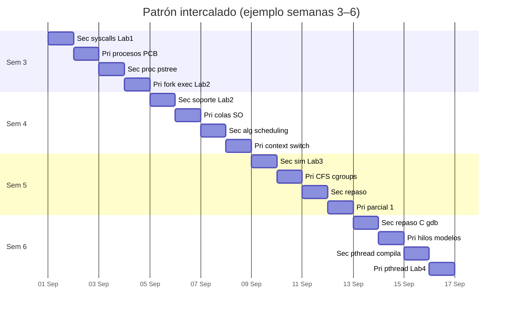

# Temario — Sistemas Operativos (dos profesores)

**Asignatura:** Sistemas Operativos (Clave 0713)  
**Facultad:** Ciencias — UNAM  
**Carrera:** Ciencias de la Computación (6.º semestre)  
**Duración:** 4 meses (~16 semanas)  
**Nivel:** Curso obligatorio de licenciatura  

---

## Organización de clases

Ambos docentes imparten **2 sesiones por semana**, en días **intercalados**:

| Día | Docente | Rol en la semana |
|-----|---------|------------------|
| **1** (Lunes) | Profesor secundario | Base, repaso o preparación del tema |
| **2** (Martes) | Profesor principal | Concepto nuevo central |
| **3** (Miércoles) | Profesor secundario | Herramientas, simulador o práctica de apoyo |
| **4** (Jueves) | Profesor principal | Profundización, lab o cierre del bloque |

**Carga total:** 16 semanas × 2 sesiones = **32 sesiones por docente** (64 sesiones en el semestre).

> Los días son orientativos; lo importante es mantener el orden **Sec → Pri → Sec → Pri** dentro de cada semana.

---

## División de responsabilidades

| Rol | Responsabilidad | Enfoque |
|-----|-----------------|---------|
| **Profesor principal** | Temas **nuevos** del curso | Procesos, concurrencia, memoria virtual, IPC, seguridad conceptual, virtualización |
| **Profesor secundario** | Temas **prerrequisito** y **secundarios** | C, arquitectura, Linux, historia, simuladores, E/S hardware, repaso e integración |

> **Coordinación:** reunión breve al inicio de cada mes para alinear evaluaciones y verificar que el día 3 (secundario) prepara lo que el día 4 (principal) cierra.

---

## Perfil del curso

Este curso corresponde a la mitad de la carrera: los alumnos ya dominan programación estructurada, estructuras de datos, algoritmos y arquitectura de computadoras. A partir de aquí, la mayoría se dedicará profesionalmente a **desarrollar software**.

El temario equilibra:

1. **Fundamentos teóricos** — por qué existen procesos, memoria virtual, permisos y system calls.
2. **Práctica con sistemas reales** — Linux, terminal, herramientas del programador.
3. **Conexión profesional** — depuración, concurrencia, rendimiento, contenedores.

---

## Prerrequisitos

*(Repasados por el **profesor secundario** en días 1 y 3 de las primeras semanas.)*

- Programación en **C** (punteros, memoria dinámica, `gcc`/`make`).
- **Estructuras de datos** y **Algoritmos** (colas, grafos básicos).
- **Arquitectura de computadoras** (CPU, memoria, interrupciones).
- **Linux** en terminal (`cd`, `ls`, `grep`, pipes).

---

## Objetivos generales del curso

Al terminar el curso, el alumno podrá:

1. Explicar las funciones fundamentales de un SO: administrar recursos y proporcionar abstracciones.
2. Describir la evolución histórica del SO y relacionarla con mecanismos modernos.
3. Modelar programas como **procesos e hilos**; analizar planificación y sincronización.
4. Explicar **memoria virtual**, paginación y protección entre procesos.
5. Describir **sistemas de archivos**, E/S y **llamadas al sistema**.
6. Identificar **condiciones de carrera e interbloqueos**; aplicar sincronización.
7. Usar herramientas profesionales: `strace`, `gdb`, `top`, Docker, señales.

---

## Vista general por mes

| Mes | Bloque | Días 1 y 3 (Secundario) | Días 2 y 4 (Principal) |
|-----|--------|---------------------------|-------------------------|
| **1** | Procesos | Historia, Linux, syscalls, simulador scheduling | Abstracciones SO, procesos, `fork`, planificación |
| **2** | Concurrencia | Repaso C, gdb, banquero, pipelines shell | Hilos, sincronización, deadlocks, IPC, señales |
| **3** | Memoria y archivos | Simuladores memoria/páginas, segmentación, permisos | Memoria virtual, layout, sistemas de archivos |
| **4** | E/S, seguridad, modernos | E/S hardware, RAID, tendencias, repaso final | E/S para programadores, seguridad, Docker, casos integradores |

---

## Calendario de sesiones (16 semanas)

### Mes 1 — Introducción y procesos

#### Semana 1 — Contexto e introducción

| Día | Docente | Contenido |
|-----|---------|-----------|
| 1 | **Sec** | Hardware vs. software vs. SO; CPU, RAM, almacenamiento (repaso Arq) |
| 2 | **Pri** | Funciones del SO: administrar recursos y abstracciones; rol del SO en el stack |
| 3 | **Sec** | Historia I: ENIAC → batch → multiprogramación → time-sharing |
| 4 | **Pri** | Historia II: UNIX → PC → Linux/cloud; abstracciones clave (proceso, archivo, socket, hilo) |

*Material secundario:* `historia2-alumnos.md`

---

#### Semana 2 — Linux, kernel y syscalls

| Día | Docente | Contenido |
|-----|---------|-----------|
| 1 | **Sec** | Terminal Linux: `uname`, `cd`, `ls`, `grep`, redirección, pipes; `ps`, `/proc` |
| 2 | **Pri** | Kernel; espacio usuario vs. kernel; tipos de SO (batch, time-sharing, RT, móvil, servidor) |
| 3 | **Sec** | Interrupciones, excepciones, traps (repaso Arq); modo usuario/kernel |
| 4 | **Pri** | System calls (concepto); costo user/kernel; blocking calls; conexión profesional |

---

#### Semana 3 — Syscalls en código y el proceso

| Día | Docente | Contenido |
|-----|---------|-----------|
| 1 | **Sec** | API POSIX: `write`, `read`, `open`, `close`; **`strace`** — **Lab 1** |
| 2 | **Pri** | Definición de proceso; PCB; estados (nuevo, listo, ejecutando, bloqueado, terminado) |
| 3 | **Sec** | `pstree`; exploración de `/proc/[pid]/status`, `/proc/[pid]/fd` |
| 4 | **Pri** | `fork()`, `exec()`, `wait()`, `exit()`; procesos zombie y huérfanos — inicio **Lab 2** |

---

#### Semana 4 — Procesos y planificación de CPU

| Día | Docente | Contenido |
|-----|---------|-----------|
| 1 | **Sec** | Soporte **Lab 2**; árbol de procesos en terminal |
| 2 | **Pri** | Transiciones de estado; colas del SO; conexión profesional (`fork` por conexión; procesos vs. contenedores) |
| 3 | **Sec** | Algoritmos clásicos: FCFS, SJF, Round Robin, prioridades; colas multinivel |
| 4 | **Pri** | Objetivos del scheduler; preemptivo vs. no preemptivo; context switch |

---

#### Semana 5 — Scheduling y evaluación mes 1

| Día | Docente | Contenido |
|-----|---------|-----------|
| 1 | **Sec** | **Simulador de planificación** (FCFS, RR) — **Lab 3**; medición de context switches |
| 2 | **Pri** | Planificación en Linux: CFS, `nice`, cgroups (visión general) |
| 3 | **Sec** | Repaso integrado mes 1: historia, terminal, syscalls, simulador |
| 4 | **Pri** | Repaso procesos y scheduling — **Examen parcial 1** |

---

### Mes 2 — Concurrencia, sincronización e IPC

#### Semana 6 — Hilos y repaso de C

| Día | Docente | Contenido |
|-----|---------|-----------|
| 1 | **Sec** | Repaso C para SO: punteros, `malloc`/`free`, `make`, Makefile básico |
| 2 | **Pri** | Proceso vs. hilo; modelos (many-to-one, one-to-one, many-to-many); memoria compartida, pila privada |
| 3 | **Sec** | Compilación multihilo; **`gdb`**: breakpoints, backtrace, inspección de hilos |
| 4 | **Pri** | `pthread_create`, `pthread_join`; paralelismo vs. concurrencia — **Lab 4** |

---

#### Semana 7 — Condiciones de carrera y sincronización I

| Día | Docente | Contenido |
|-----|---------|-----------|
| 1 | **Sec** | Demo condición de carrera sin protección; soporte **Lab 4** |
| 2 | **Pri** | Condiciones de carrera; sección crítica; requisitos (exclusión mutua, progreso, espera limitada) |
| 3 | **Sec** | Soporte implementación de mutex en C |
| 4 | **Pri** | Mutex y semáforos (Dijkstra); variables de condición (`pthread_cond`) |

---

#### Semana 8 — Sincronización II y problemas clásicos

| Día | Docente | Contenido |
|-----|---------|-----------|
| 1 | **Sec** | Soporte lab: buffer acotado, depuración de deadlocks simples |
| 2 | **Pri** | Productor-consumidor; lectores-escritores; monitores (concepto) |
| 3 | **Sec** | Filósofos comensales — sesión guiada de lab |
| 4 | **Pri** | Filósofos comensales (cierre); atomicidad (`stdatomic`) — **Lab 5** |

---

#### Semana 9 — Interbloqueos

| Día | Docente | Contenido |
|-----|---------|-----------|
| 1 | **Sec** | Repaso de grafos (Algoritmos); grafos de asignación de recursos |
| 2 | **Pri** | Condiciones de Coffman; estrategias: prevención, evasión, detección, recuperación, ignorar |
| 3 | **Sec** | **Simulación del algoritmo del banquero**; análisis guiado de escenarios |
| 4 | **Pri** | Deadlocks en la práctica: orden de locks, timeouts; diseño para evitarlos |

---

#### Semana 10 — IPC, señales y evaluación mes 2

| Día | Docente | Contenido |
|-----|---------|-----------|
| 1 | **Sec** | Pipelines en shell; composición de procesos con pipes del terminal |
| 2 | **Pri** | IPC: motivación; pipes anónimos y FIFO; memoria compartida (`mmap`) |
| 3 | **Sec** | Soporte **Lab 6**: pipes en C, comunicación padre-hijo |
| 4 | **Pri** | Colas de mensajes; señales (`signal`, `sigaction`: SIGINT, SIGCHLD, SIGTERM); IPC vs. hilos — **Examen parcial 2** |

---

### Mes 3 — Memoria y sistemas de archivos

#### Semana 11 — Fundamentos de memoria

| Día | Docente | Contenido |
|-----|---------|-----------|
| 1 | **Sec** | Contigüidad; particionamiento fijo y dinámico; fragmentación interna/externa |
| 2 | **Pri** | Direccionamiento lógico vs. físico; paginación: marcos, páginas, tabla de páginas |
| 3 | **Sec** | Swapping; registros base/límite; **simulador** first-fit / best-fit / worst-fit |
| 4 | **Pri** | Protección de memoria entre procesos; OOM killer; `ulimit` y cgroups |

---

#### Semana 12 — Memoria virtual

| Día | Docente | Contenido |
|-----|---------|-----------|
| 1 | **Sec** | Repaso paginación; TLB (introducción desde simulador) |
| 2 | **Pri** | Memoria virtual: demand paging, page fault, page-in/page-out |
| 3 | **Sec** | **Simulador de reemplazo de páginas** (FIFO, LRU, Clock) — **Lab 7** |
| 4 | **Pri** | Thrashing y working set; copy-on-write y su papel en `fork()`; `/proc/[pid]/maps` |

---

#### Semana 13 — Layout de memoria y segmentación

| Día | Docente | Contenido |
|-----|---------|-----------|
| 1 | **Sec** | Segmentación: código, datos, pila, heap; tablas de segmentos; modelo x86-64 simplificado |
| 2 | **Pri** | Layout en Linux: text, data, bss, heap, stack |
| 3 | **Sec** | Stack vs. heap (experimento); **Valgrind** (`memcheck`) |
| 4 | **Pri** | ASLR y seguridad; conexión profesional (GC vs. C, page faults, `mmap`) |

---

#### Semana 14 — Sistemas de archivos y evaluación mes 3

| Día | Docente | Contenido |
|-----|---------|-----------|
| 1 | **Sec** | Permisos Unix: owner, group, others; `chmod`, `chown`, `umask`; `ls -i`, `stat` — **Lab 8** |
| 2 | **Pri** | Archivos, directorios, metadata; operaciones open/read/write/seek |
| 3 | **Sec** | Enlaces duros y simbólicos; ejercicio de permisos inseguros |
| 4 | **Pri** | Inodos, bloques, punteros directos/indirectos; ext4 vs. NTFS; journaling — **Examen parcial 3** |

---

### Mes 4 — E/S, seguridad, virtualización e integración

#### Semana 15 — Entrada/Salida

| Día | Docente | Contenido |
|-----|---------|-----------|
| 1 | **Sec** | Jerarquía de memoria; dispositivos bloque vs. carácter; drivers; E/S programada, DMA |
| 2 | **Pri** | E/S bloqueante vs. async (visión programador); impacto en servidores y BD |
| 3 | **Sec** | Scheduling de disco (FCFS, SSTF, SCAN); RAID; buffering y spooling; `iostat`, `dd` — **Lab 9** |
| 4 | **Pri** | SSD vs. HDD; por qué optimizar I/O; conexión con rendimiento de aplicaciones |

---

#### Semana 16 — Seguridad

| Día | Docente | Contenido |
|-----|---------|-----------|
| 1 | **Sec** | Capabilities (`getcap`); SELinux / AppArmor (panorama); symlink race (demo controlada) |
| 2 | **Pri** | CIA (confidencialidad, integridad, disponibilidad); autenticación y autorización |
| 3 | **Sec** | Repaso permisos y ACL; sandboxing desde la terminal |
| 4 | **Pri** | Ataques: buffer overflow, privilege escalation; defensa: ASLR, DEP/NX, namespaces |

---

#### Semana 17 — Virtualización y contenedores

| Día | Docente | Contenido |
|-----|---------|-----------|
| 1 | **Sec** | eBPF, unikernels, serverless (panorama); Kubernetes (visión general) |
| 2 | **Pri** | Virtualización Tipo 1 y 2; VMs vs. contenedores |
| 3 | **Sec** | Comparar proceso normal vs. en contenedor (`/proc`, cgroups) |
| 4 | **Pri** | Namespaces, cgroups; Docker (imagen, capas, Dockerfile) — **Lab 10** |

---

#### Semana 18 — Cierre del curso

| Día | Docente | Contenido |
|-----|---------|-----------|
| 1 | **Sec** | Mapa conceptual del curso; repaso por bloques (procesos → memoria → archivos → E/S) |
| 2 | **Pri** | Caso integrador: “¿Qué pasa al ejecutar `python script.py`?” (capas hasta syscalls) |
| 3 | **Sec** | Sesión de preguntas; repaso simuladores y herramientas; proyección a Redes y Sistemas distribuidos |
| 4 | **Pri** | Caso integrador: depuración end-to-end; “¿Qué pasa al abrir una URL?” — **Examen final / proyecto** |

> **Nota:** Si el semestre tiene exactamente 16 semanas lectivas, comprimir semanas 17–18 fusionando virtualización (sem. 16) y cierre (sem. 16, días 3–4). Ver [ajuste a 16 semanas](#ajuste-a-16-semanas-lectivas) al final.

---

## Temario detallado por sesión

A continuación el mismo contenido con mayor detalle, agrupado por semana.

### Mes 1

**Semana 1**

| Día | Docente | Temas | Práctica |
|-----|---------|-------|----------|
| 1 | Sec | Hardware, software, SO; repaso CPU/RAM/disco | — |
| 2 | Pri | Funciones del SO; abstracciones como interfaz al hardware | — |
| 3 | Sec | Historia hasta time-sharing; factores económicos y técnicos | — |
| 4 | Pri | Historia UNIX→cloud; mapa de abstracciones del curso | — |

**Semana 2**

| Día | Docente | Temas | Práctica |
|-----|---------|-------|----------|
| 1 | Sec | Terminal Linux; `ps`; introducción a `/proc` | Exploración del sistema |
| 2 | Pri | Kernel; espacio usuario/kernel; taxonomía de SO | — |
| 3 | Sec | Interrupciones, traps; transición user→kernel | — |
| 4 | Pri | System calls; blocking I/O en servidores | — |

**Semana 3**

| Día | Docente | Temas | Práctica |
|-----|---------|-------|----------|
| 1 | Sec | API POSIX mínima; `strace` | **Lab 1** |
| 2 | Pri | Proceso, PCB, estados, transiciones | — |
| 3 | Sec | `/proc` en detalle; `pstree` | Observación de procesos vivos |
| 4 | Pri | `fork`/`exec`/`wait`; zombies | **Lab 2** (inicio) |

**Semana 4**

| Día | Docente | Temas | Práctica |
|-----|---------|-------|----------|
| 1 | Sec | Soporte Lab 2; lectura de árbol de procesos | Terminal |
| 2 | Pri | Colas del SO; servidores con `fork` | — |
| 3 | Sec | FCFS, SJF, RR, prioridades | Papel y lápiz / simulador |
| 4 | Pri | Objetivos del scheduler; context switch | — |

**Semana 5**

| Día | Docente | Temas | Práctica |
|-----|---------|-------|----------|
| 1 | Sec | Simulador scheduling; context switches medidos | **Lab 3** |
| 2 | Pri | CFS, `nice`, cgroups | — |
| 3 | Sec | Repaso mes 1 | — |
| 4 | Pri | **Examen parcial 1** | Evaluación |

---

### Mes 2

**Semana 6**

| Día | Docente | Temas | Práctica |
|-----|---------|-------|----------|
| 1 | Sec | Repaso C: punteros, `malloc`, `make` | Compilación |
| 2 | Pri | Hilos vs. procesos; modelos de hilos | — |
| 3 | Sec | `gdb` intro; compilar con `-pthread` | Depuración |
| 4 | Pri | pthreads; concurrencia vs. paralelismo | **Lab 4** |

**Semana 7**

| Día | Docente | Temas | Práctica |
|-----|---------|-------|----------|
| 1 | Sec | Demo race condition | **Lab 4** soporte |
| 2 | Pri | Sección crítica; requisitos de solución | — |
| 3 | Sec | Implementación de mutex | Código guiado |
| 4 | Pri | Mutex, semáforos, cond vars | — |

**Semana 8**

| Día | Docente | Temas | Práctica |
|-----|---------|-------|----------|
| 1 | Sec | Soporte labs sincronización | — |
| 2 | Pri | Productor-consumidor; lectores-escritores | — |
| 3 | Sec | Filósofos — lab guiado | — |
| 4 | Pri | Filósofos; atomicidad | **Lab 5** |

**Semana 9**

| Día | Docente | Temas | Práctica |
|-----|---------|-------|----------|
| 1 | Sec | Grafos de recursos; repaso Algoritmos | — |
| 2 | Pri | Coffman; estrategias anti-deadlock | — |
| 3 | Sec | Algoritmo del banquero | Simulación |
| 4 | Pri | Deadlocks en código real | — |

**Semana 10**

| Día | Docente | Temas | Práctica |
|-----|---------|-------|----------|
| 1 | Sec | Pipelines shell | Terminal |
| 2 | Pri | Pipes, FIFO, `mmap`, colas de mensajes | — |
| 3 | Sec | Pipes en C | **Lab 6** |
| 4 | Pri | Señales; comparación IPC — **Examen parcial 2** | Evaluación |

---

### Mes 3

**Semana 11**

| Día | Docente | Temas | Práctica |
|-----|---------|-------|----------|
| 1 | Sec | Particionamiento; fragmentación | Simulador asignación |
| 2 | Pri | Paginación; direcciones lógicas/físicas | — |
| 3 | Sec | Swapping; base/límite | Simulador |
| 4 | Pri | Protección; OOM; límites de proceso | — |

**Semana 12**

| Día | Docente | Temas | Práctica |
|-----|---------|-------|----------|
| 1 | Sec | TLB; repaso paginación | — |
| 2 | Pri | Memoria virtual; page faults | — |
| 3 | Sec | Reemplazo FIFO/LRU/Clock | **Lab 7** |
| 4 | Pri | Thrashing; COW; `/proc/[pid]/maps` | Observación |

**Semana 13**

| Día | Docente | Temas | Práctica |
|-----|---------|-------|----------|
| 1 | Sec | Segmentación; x86 simplificado | — |
| 2 | Pri | Layout text/data/bss/heap/stack | — |
| 3 | Sec | Stack vs. heap; Valgrind | **memcheck** |
| 4 | Pri | ASLR; mmap; GC vs. manual | — |

**Semana 14**

| Día | Docente | Temas | Práctica |
|-----|---------|-------|----------|
| 1 | Sec | Permisos Unix; inodos con `stat` | **Lab 8** |
| 2 | Pri | Operaciones de archivos; metadata | — |
| 3 | Sec | Enlaces; permisos inseguros | Ejercicio |
| 4 | Pri | Inodos; ext4; journaling — **Examen parcial 3** | Evaluación |

---

### Mes 4

**Semana 15**

| Día | Docente | Temas | Práctica |
|-----|---------|-------|----------|
| 1 | Sec | Jerarquía memoria; DMA; drivers | — |
| 2 | Pri | E/S bloqueante; async (concepto) | — |
| 3 | Sec | Disk scheduling; RAID; `iostat` | **Lab 9** |
| 4 | Pri | SSD/HDD; I/O en aplicaciones | — |

**Semana 16**

| Día | Docente | Temas | Práctica |
|-----|---------|-------|----------|
| 1 | Sec | Capabilities; SELinux (panorama) | — |
| 2 | Pri | CIA; autenticación; control de acceso | — |
| 3 | Sec | eBPF; serverless; K8s (panorama) | Lectura |
| 4 | Pri | VMs; namespaces; cgroups | — |

**Semana 17** *(o fusionada con 16 si aplica)*

| Día | Docente | Temas | Práctica |
|-----|---------|-------|----------|
| 1 | Sec | Proceso vs. contenedor en `/proc` | Comparación |
| 2 | Pri | Docker: imagen, capas, Dockerfile | **Lab 10** |
| 3 | Sec | Mapa conceptual; repaso transversal | — |
| 4 | Pri | Caso: ejecución de un programa | Integrador |

**Semana 18** *(o fusionada con 16–17 si aplica)*

| Día | Docente | Temas | Práctica |
|-----|---------|-------|----------|
| 1 | Sec | Preguntas; repaso herramientas | — |
| 2 | Pri | Caso: abrir una URL (capas) | Integrador |
| 3 | Sec | Proyección a cursos siguientes | — |
| 4 | Pri | **Examen final** / presentación proyecto | Evaluación |

---

## Ajuste a 16 semanas lectivas

Si solo hay **16 semanas**, usar esta fusión:

| Semanas originales | Semana final | Cambio |
|--------------------|--------------|--------|
| 15 + 16 (E/S + Seguridad) | Semana 15 | Mantener las 4 sesiones de cada una comprimidas en 4 sesiones: E/S (d1–d2), Seguridad (d3–d4) |
| 17 + 18 (Docker + Cierre) | Semana 16 | d1 Sec: contenedores + repaso; d2 Pri: Docker Lab 10; d3 Sec: mapa + preguntas; d4 Pri: final |

**Semana 16 compacta (16 semanas reales):**

| Día | Docente | Contenido |
|-----|---------|-----------|
| 1 | **Sec** | RAID/`iostat` (cierre E/S); capabilities; repaso permisos |
| 2 | **Pri** | Seguridad: CIA, buffer overflow, namespaces |
| 3 | **Sec** | Contenedor vs. proceso; mapa conceptual; repaso |
| 4 | **Pri** | Docker **Lab 10**; casos integradores — **Examen final** |

---

## Laboratorio — calendario intercalado

Los labs se asignan preferentemente a **día 1 o 3 (secundario)** para herramientas/simuladores y **día 4 (principal)** para programación central:

| Lab | Tema | Semana | Día | Docente |
|-----|------|--------|-----|---------|
| 1 | `/proc` y `strace` | 3 | 1 | Sec |
| 2 | `fork`/`exec`/`wait` | 3–4 | 4 / 1 | Pri / Sec |
| 3 | Simulador scheduling | 5 | 1 | Sec |
| 4 | pthreads y race conditions | 6–7 | 4 / 1 | Pri / Sec |
| 5 | Productor-consumidor | 8 | 4 | Pri |
| 6 | Pipes y señales | 10 | 3 | Sec |
| 7 | Reemplazo de páginas | 12 | 3 | Sec |
| 8 | Permisos e inodos | 14 | 1 | Sec |
| 9 | I/O con `iostat` | 15 | 3 | Sec |
| 10 | Docker y namespaces | 17* | 4 | Pri |

*\*Semana 16 en calendario compacto.*

---

## Esquema de evaluación

| Componente | Peso | Cuándo | Docente |
|------------|------|--------|---------|
| Parcial 1 | 15 % | Sem 5, día 4 | Pri (procesos) + Sec (historia, syscalls, simulador) |
| Parcial 2 | 15 % | Sem 10, día 4 | Pri (hilos, sync, IPC) + Sec (C, banquero, pipes) |
| Parcial 3 | 15 % | Sem 14, día 4 | Pri (mem virtual, FS) + Sec (simuladores, permisos) |
| Final / proyecto | 20 % | Sem 16–18, día 4 | Compartido |
| Laboratorios | 25 % | Continuo | Según tabla |
| Participación | 10 % | Continuo | Ambos |

---

## Bibliografía

- **Silberschatz, Galvin, Gagne** — *Operating System Concepts* (10.ª ed.)
- **Tanenbaum & Bos** — *Modern Operating Systems* (4.ª ed.)
- **Arpaci-Dusseau** — *OSTEP* (gratuito): [https://pages.cs.wisc.edu/~remzi/OSTEP/](https://pages.cs.wisc.edu/~remzi/OSTEP/)
- Material del curso: `historia2-alumnos.md`, guías de lab

---

## Diagrama del ritmo semanal

---

## Notas de coordinación

1. **Día 1 (Sec) prepara día 2 (Pri):** el secundario nunca adelanta conceptos nuevos centrales; introduce vocabulario, repaso o herramientas.
2. **Día 3 (Sec) consolida día 2 (Pri):** simuladores, labs de soporte, ejercicios guiados.
3. **Día 4 (Pri) cierra la semana:** profundiza, evalúa o conecta con el mundo profesional.
4. **Excepción semana 1:** el principal también cubre historia (día 4) porque es narrativa central del curso, no prerrequisito.
5. **Reunión quincenal** (15 min): revisar que el ritmo Sec→Pri→Sec→Pri se mantiene y ajustar si un grupo necesita más repaso en días 1/3.

---

*Temario — Facultad de Ciencias, UNAM. Versión dos docentes, clases intercaladas 2+2 por semana.*
