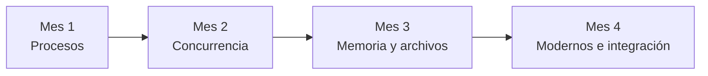
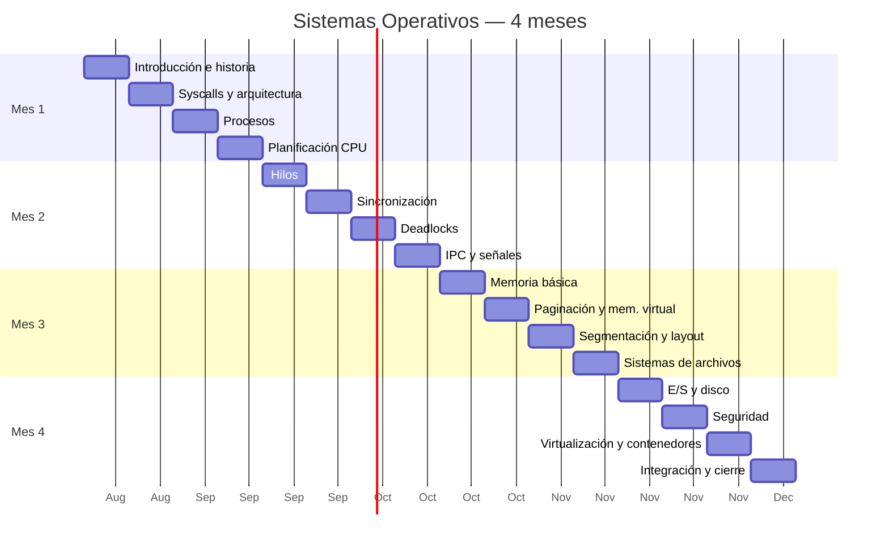

# Temario — Sistemas Operativos

**Asignatura:** Sistemas Operativos (Clave 0713)  
**Facultad:** Ciencias — UNAM  
**Carrera:** Ciencias de la Computación (6.º semestre)  
**Duración:** 4 meses (~16 semanas)  
**Nivel:** Curso obligatorio de licenciatura  

---

## Perfil del curso

Este curso corresponde a la mitad de la carrera: los alumnos ya dominan programación estructurada, estructuras de datos, algoritmos y arquitectura de computadoras. A partir de aquí, la mayoría se dedicará profesionalmente a **desarrollar software** — aplicaciones web, backends, sistemas distribuidos, datos, infraestructura — no a diseñar hardware ni a ser administradores de sistemas de forma exclusiva.

Por eso el temario equilibra tres cosas:

1. **Fundamentos teóricos** que explican *por qué* existen procesos, memoria virtual, permisos y system calls.
2. **Práctica con sistemas reales** (Linux, terminal, herramientas del día a día del programador).
3. **Conexión con el trabajo profesional**: depuración, concurrencia, rendimiento, contenedores, servidores y la nube.

> Un buen programador no necesita memorizar cada algoritmo de planificación, pero sí entender qué hace el SO cuando su programa hace `fork()`, abre un archivo, crea un hilo o consume toda la RAM.

---

## Prerrequisitos

Se asume dominio de:

- Programación en **C** (punteros, memoria dinámica, compilación con `gcc`/`make`).
- **Estructuras de datos** (listas, colas, árboles, tablas hash).
- **Algoritmos** (complejidad, grafos básicos).
- **Arquitectura de computadoras** (CPU, memoria, registros, instrucciones máquina, interrupciones).
- Uso básico de **Linux** en terminal (`cd`, `ls`, `grep`, permisos, pipes).

---

## Objetivos generales del curso

Al terminar el curso, el alumno podrá:

1. Explicar las **funciones fundamentales** de un sistema operativo: administrar recursos y proporcionar abstracciones.
2. Describir la **evolución histórica** del SO y relacionar problemas reales (costo del CPU, multiprogramación, protección) con mecanismos modernos.
3. Modelar la ejecución de programas como **procesos e hilos**, analizar estados, planificación y sincronización.
4. Explicar la **administración de memoria**, incluyendo paginación, memoria virtual y protección entre procesos.
5. Describir **sistemas de archivos**, E/S y cómo el SO expone recursos mediante **llamadas al sistema**.
6. Identificar problemas clásicos (**condiciones de carrera, interbloqueos**) y aplicar mecanismos de sincronización.
7. Relacionar conceptos del curso con **herramientas que usarán como programadores**: `strace`, `gdb`, `top`/`htop`, Docker, permisos Unix, señales y depuración de procesos concurrentes.

---

## Distribución temporal (4 meses)

| Mes | Tema central | Enfoque práctico |
|-----|--------------|------------------|
| **1** | Introducción, historia y procesos | Linux, syscalls, `fork`/`exec`, estados del proceso |
| **2** | Planificación y concurrencia | Hilos, mutex, semáforos, patrones de sincronización |
| **3** | Memoria y almacenamiento | Paginación, memoria virtual, sistema de archivos |
| **4** | E/S, seguridad y sistemas modernos | Permisos, virtualización, contenedores, repaso e integración |



---

## Temario detallado por semana

### Mes 1 — Fundamentos e introducción a procesos

#### Semana 1: ¿Qué es un sistema operativo?

- Rol del SO entre hardware y aplicaciones.
- Hardware vs. software vs. sistema operativo.
- Kernel, espacio de usuario y espacio de kernel.
> clasificación de sistemas operativos (de tiempo real, de proposito general, servidores, hypervisores, etc)
- Tipos de SO: batch, tiempo compartido, tiempo real, embebidos, móviles, servidores.
- **Historia:** de ENIAC a contenedores y nube (procesamiento por lotes → multiprogramación → time-sharing → UNIX → PC → Linux/cloud).
- Abstracciones clave: proceso, archivo, socket, hilo, memoria virtual.

**Práctica:** exploración del sistema con terminal (`uname`, `ps`, `ls /proc`, lectura de `/proc/[pid]/status`).


---

#### Semana 2: Arquitectura del SO y llamadas al sistema

- Modo usuario vs. modo kernel.
- Interrupciones, excepciones y traps.
> Ciclo de fetch. Modelo teorico Random Access Machine 
- API del SO, wrapper de biblioteca y **system call**.
- Costo de cruzar el límite usuario/kernel.
- Introducción a la API POSIX en Linux.

**Práctica:** programas mínimos con `write`, `read`, `open`, `close`; uso de `strace` para observar syscalls.

**Conexión profesional:** por qué I/O síncrona masiva puede ser un cuello de botella; qué significa “blocking call”.

---

#### Semana 3: El proceso como abstracción central

- Definición de proceso: programa + estado de ejecución.
- PCB (Process Control Block): PID, registros, puntero de pila, espacio de direcciones, descriptores de archivo.
> Estados: nuevo, listo, ejecutando, bloqueado, terminado.
> Transiciones de estado y colas del SO.
- Creación y terminación de procesos.
- Árboles de procesos: `fork()`, `exec()`, `wait()`, `exit()`.
- Procesos zombie y huérfanos.

**Práctica:** árbol de procesos con `fork`; visualización con `pstree` y `/proc`.

**Conexión profesional:** cómo funcionan servidores que hacen `fork` por conexión (modelo clásico); procesos vs. contenedores.

---

#### Semana X: Planificación de CPU (introducción)

- Objetivos del scheduler: utilización, throughput, tiempo de respuesta, equidad.
- Planificación preemptiva vs. no preemptiva.
- Algoritmos clásicos: FCFS, SJF, Round Robin, prioridades.
- Planificadores de colas multinivel y feedback.
- Context switch: qué se guarda y qué cuesta.
- Planificación en Linux (visión general: CFS, nice, cgroups).

**Práctica:** simulador de planificación (FCFS, RR con quantum); medición de context switches con herramientas del sistema.


---

### Mes 2 — Concurrencia, sincronización e interbloqueos

#### Semana 5: Hilos y paralelismo

- Proceso vs. hilo: memoria compartida, pila privada, creación más liviana.
- Hilos a nivel de usuario vs. kernel (pthreads).
> Hilos de kernel
- Modelos: many-to-one, one-to-one, many-to-many.
- Programación concurrente en C con **pthreads** (`pthread_create`, `pthread_join`).
- Paralelismo vs. concurrencia.
- Condiciones de carrera: definición y ejemplos.

**Práctica:** contador compartido sin protección → demostración de condición de carrera; corrección con mutex.

**Conexión profesional:** hilos en servidores, pools de workers, async/await como abstracción de más alto nivel.

---

#### Semana 6: Mecanismos de sincronización

- Sección crítica y requisitos de solución (exclusión mutua, progreso, espera limitada).
- Mutex y semáforos (Dijkstra).
- Variables de condición (`pthread_cond`).
- Monitores (concepto).
- Problemas clásicos:
  - Productor-consumidor (buffer acotado).
  - Lectores-escritores.
  - Filósofos comensales.
- Atomicidad y operaciones atómicas (`stdatomic` / `__sync_*` en C).

**Práctica:** implementación de buffer acotado y filósofos comensales con semáforos o mutex + cond.

**Conexión profesional:** locks en bases de datos, race conditions en caches web, deadlocks en microservicios.

---

#### Semana 7: Interbloqueos (deadlocks)

- Condiciones de Coffman (mutua exclusión, retención y espera, no preemptividad, espera circular).
- Grafos de asignación de recursos.
- Estrategias: prevención, evasión (banquero), detección y recuperación, ignorar (estrategia de Linux en muchos casos).
- Algoritmo del banquero.
- Interbloqueos en la práctica: orden de adquisición de locks, timeouts, diseño lock-free cuando aplique.

**Práctica:** simulación del algoritmo del banquero; análisis de un escenario de deadlock en código multihilo.

---

#### Semana 8: Comunicación entre procesos (IPC)

- Motivación: procesos con espacios de direcciones separados.
- Pipes anónimos y con nombre (FIFO).
- Memoria compartida (`shmget`/`mmap`).
- Colas de mensajes.
- Señales en Unix (`signal`, `sigaction`): SIGINT, SIGCHLD, SIGTERM.
- Comparación IPC vs. hilos vs. sockets locales.

**Práctica:** pipeline con pipes; comunicación padre-hijo; manejo de señales.

**Evaluación del mes 2:** examen parcial 2 o proyecto corto de concurrencia (productor-consumidor o similar).

---

### Mes 3 — Memoria, almacenamiento y sistemas de archivos

#### Semana 9: Administración de memoria — fundamentos

- Direccionamiento: lógico vs. físico.
- Contigüidad, particionamiento fijo y dinámico.
- Fragmentación interna y externa.
- Swapping: mover procesos entre RAM y disco.
- Relocalización, base y límite, registros base/límite.
- Protección de memoria entre procesos.

**Práctica:** simulador de asignación de memoria (first-fit, best-fit, worst-fit).

**Conexión profesional:** por qué un proceso “se come” la RAM; OOM killer; límites con `ulimit` y cgroups.

---

#### Semana 10: Paginación y memoria virtual

- Paginación: marcos, páginas, tabla de páginas.
- TLB (Translation Lookaside Buffer).
- Paginación multinivel (visión conceptual).
- Memoria virtual: demand paging, page fault, page-in/page-out.
- Reemplazo de páginas: FIFO, LRU (aproximaciones), Clock.
- Thrashing y working set.
- Copy-on-write y su papel en `fork()`.

**Práctica:** simulador de reemplazo de páginas; observación de mapa de memoria con `/proc/[pid]/maps`.

**Conexión profesional:** memoria en lenguajes con GC vs. C; page faults y rendimiento; mmap para archivos grandes.

---

#### Semana 11: Segmentación y modelos combinados

- Segmentación: segmentos lógicos (código, datos, pila, heap).
- Tablas de segmentos y protección por segmento.
- Modelo segmentación + paginación (visión general, p. ej. x86-64 simplificado).
- Espacio de direcciones en Linux: layout de un proceso (text, data, bss, heap, stack).
- ASLR (Address Space Layout Randomization) y seguridad.

**Práctica:** lectura de mapas de memoria; experimento con variables en stack vs. heap; introducción a Valgrind (`memcheck`).

---

#### Semana 12: Sistemas de archivos

- Concepto de archivo, directorio y metadata.
- Operaciones: crear, abrir, leer, escribir, cerrar, seek, truncar.
- Implementación: bloques, inodos, directorios, punteros directos e indirectos.
- Sistemas de archivos comunes: ext4, NTFS (comparación), FAT32.
- Montaje, rutas absolutas/relativas, enlaces duros y simbólicos.
- Permisos Unix: owner, group, others; `rwx`; `chmod`, `chown`.
- Journaling y consistencia ante fallos.

**Práctica:** exploración de inodos con `ls -i`, `stat`; permisos y umask; implementación de un mini-FS en memoria o análisis de estructura ext4.

**Evaluación del mes 3:** examen parcial 3 o entrega sobre memoria virtual + archivos.

---

### Mes 4 — E/S, seguridad, virtualización e integración

#### Semana 13: Entrada/Salida y almacenamiento en disco

- Jerarquía de memoria (registros → caché → RAM → SSD/HDD → red).
- Dispositivos de bloque vs. carácter.
- Controladores de dispositivo y drivers.
- E/S programada, interrupciones, DMA.
- Scheduling de disco: FCFS, SSTF, SCAN, C-SCAN.
- RAID (niveles 0, 1, 5 — visión conceptual).
- Buffering, caching y spooling.

**Práctica:** medición de I/O con `iostat`, `dd`; impacto de E/S en rendimiento de aplicaciones.

**Conexión profesional:** por qué las bases de datos optimizan I/O; SSD vs. HDD; async I/O en servidores.

---

#### Semana 14: Seguridad y protección

- Confidencialidad, integridad, disponibilidad.
- Autenticación y autorización.
- Control de acceso: listas ACL, modelos de permisos (Unix, capabilities en Linux).
- Usuarios, grupos, sudo, principio de mínimo privilegio.
- Ataques relacionados con SO: buffer overflow, privilege escalation, symlink attacks.
- Mecanismos de defensa: ASLR, DEP/NX, sandboxing, namespaces.
- Introducción a SELinux/AppArmor (concepto, no configuración avanzada).

**Práctica:** análisis de permisos inseguros; demostración de symlink race (controlada); revisión de capabilities con `getcap`.

**Conexión profesional:** seguridad en deployment; contenedores no son aislamiento perfecto; secrets y permisos en CI/CD.

---

#### Semana 15: Virtualización, contenedores y sistemas modernos

- Virtualización de hardware: hypervisor Tipo 1 y Tipo 2.
- Máquinas virtuales vs. contenedores.
- Namespaces y cgroups en Linux (base de Docker/Kubernetes).
- Introducción a Docker: imagen, contenedor, capas, Dockerfile básico.
- Cloud computing y SO: elasticidad, orquestación (visión general de Kubernetes).
- Microservicios y el rol del SO en infraestructura moderna.
- Tendencias: eBPF, unikernels, serverless (visión panorámica).

**Práctica:** correr un contenedor; inspeccionar namespaces (`lsns`); comparar proceso normal vs. proceso en contenedor.

**Conexión profesional:** lo que un desarrollador necesita saber de Docker, logs, recursos y despliegue.

---

#### Semana 16: Integración, repaso y cierre

- Mapa conceptual del curso: cómo se conectan procesos, memoria, archivos, E/S y seguridad.
- Casos de estudio integradores:
  - “¿Qué pasa cuando ejecutas `python script.py`?”
  - “¿Qué pasa cuando abres una URL en el navegador?” (visión por capas hasta syscalls).
  - Depuración end-to-end de un bug de concurrencia o memoria.
- Repaso de temas evaluables.
- Proyección hacia cursos siguientes: redes, bases de datos, sistemas distribuidos, compiladores.

**Evaluación del mes 4:** examen final o presentación de proyecto integrador.

---

## Laboratorio y prácticas (orientadas al programador)

Las sesiones de laboratorio complementan la teoría con ejercicios en **Linux + C + terminal**. Prioridad: entender el comportamiento del SO, no administrar servidores.

| # | Práctica | Tema |
|---|----------|------|
| 1 | Exploración de `/proc` y syscalls con `strace` | Introducción |
| 2 | Procesos con `fork`/`exec`/`wait` | Procesos |
| 3 | Simulador de planificación CPU | Scheduling |
| 4 | Hilos y condiciones de carrera con pthreads | Concurrencia |
| 5 | Productor-consumidor con semáforos | Sincronización |
| 6 | Pipes, señales e IPC | IPC |
| 7 | Simulador de reemplazo de páginas | Memoria virtual |
| 8 | Permisos, inodos y mini ejercicio de FS | Archivos |
| 9 | Medición de I/O y rendimiento | E/S |
| 10 | Contenedor Docker y namespaces | Sistemas modernos |

**Herramientas que el alumno debe conocer al final del curso:**

```text
Terminal     gcc, make, gdb, valgrind
Procesos     ps, top, htop, pstree, strace, ltrace
Memoria      /proc/[pid]/maps, free, ulimit
Archivos     ls, stat, chmod, find, ln
Red/local    ss, curl (visión básica)
Contenedores docker (run, ps, logs, exec)
```

---

## Proyecto integrador (opcional pero recomendado)

Un proyecto que conecte al menos **tres áreas** del curso. Ejemplos:

1. **Shell minimalista:** parseo de comandos, `fork`/`exec`, pipes, redirección, jobs en background.
2. **Simulador de SO en userspace:** scheduler + gestor de memoria paginada + FS en memoria.
3. **Servidor concurrente:** atender múltiples clientes con threads o `select`/`poll`, con logging y manejo de señales.
4. **Análisis de rendimiento:** programa multihilo con mediciones de context switches, page faults e I/O.

Entregables sugeridos: código, README con compilación/ejecución, reporte breve explicando decisiones de diseño y qué conceptos del curso aplicaron.

---

## Esquema de evaluación sugerido

| Componente | Peso sugerido |
|------------|---------------|
| Exámenes parciales (2–3) | 45 % |
| Laboratorios / prácticas | 25 % |
| Proyecto o tareas integradoras | 20 % |
| Participación / quizzes | 10 % |

> Ajustar según el reglamento vigente de la Facultad de Ciencias y la carga real del grupo.

---

## Bibliografía

### Texto principal (referencia clásica)

- **Silberschatz, A.; Galvin, P.; Gagne, G.** *Operating System Concepts* (10.ª ed.). Wiley.  
  *(En español: Fundamentos de Sistemas Operativos.)*

### Complementaria

- **Tanenbaum, A.; Bos, H.** *Modern Operating Systems* (4.ª ed.). Pearson.
- **Arpaci-Dusseau, R.; Arpaci-Dusseau, A.** *Operating Systems: Three Easy Pieces* (OSTEP) — [https://pages.cs.wisc.edu/~remzi/OSTEP/](https://pages.cs.wisc.edu/~remzi/OSTEP/) — **gratuito en línea**, muy recomendable.
- **Bovet, D.; Cesati, M.** *Understanding the Linux Kernel* (referencia avanzada, consulta puntual).

### Documentación y recursos prácticos

- Manual de referencia de **pthreads** y **POSIX** (`man 2`, `man 3`, `man 7`).
- Documentación del kernel Linux: [https://www.kernel.org/doc/html/latest/](https://www.kernel.org/doc/html/latest/)
- Material del curso: apuntes de historia, presentaciones y guías de laboratorio.

---

## Competencias profesionales al finalizar

Al concluir los 4 meses, un alumno orientado a programación debería poder:

| Situación real | Lo que entiende del SO |
|----------------|------------------------|
| Su programa consume mucha RAM | heap, page faults, OOM, límites de proceso |
| Bug intermitente en producción | race condition, deadlock, señales |
| Deploy con Docker | procesos, namespaces, cgroups, filesystem layers |
| “¿Por qué `kill -9`?” | señales, estados del proceso, zombie |
| Servidor lento bajo carga | scheduling, I/O blocking, context switches |
| Permiso denegado al escribir un archivo | permisos Unix, umask, propietario/grupo |
| Depurar un crash | core dump, gdb, segmentación, stack overflow |

---

## Calendario resumido



> Las fechas son orientativas; ajustar al calendario escolar oficial del semestre.

---

## Notas para el docente

- **Priorizar intuición sobre memorización:** los algoritmos clásicos (SJF, banquero, LRU) enseñan a *pensar* sobre recursos; en producción rara vez se implementan a mano.
- **Usar analogías históricas** al inicio de cada bloque (como en la sesión de historia) para anclar el “por qué”.
- **Evitar convertir el curso en administración de Linux:** los comandos se enseñan como instrumentos de observación del SO, no como fin en sí mismos.
- **C y pthreads** siguen siendo el mejor puente entre teoría y práctica; lenguajes de más alto nivel pueden mencionarse como capas sobre los mismos conceptos.
- **Dejar tiempo para depuración:** `gdb`, Valgrind y `strace` son habilidades que los alumnos usarán años después del curso.

---

*Temario elaborado para la Facultad de Ciencias, UNAM — Carrera de Ciencias de la Computación, 6.º semestre.*
